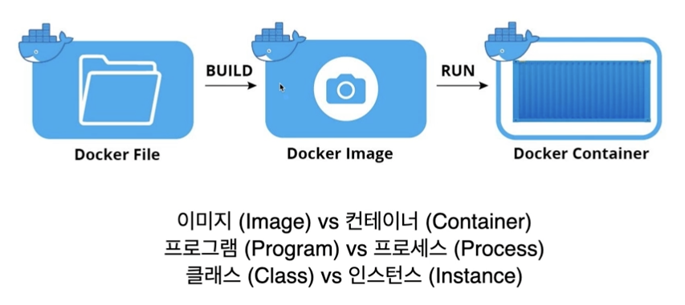

## docker 구성요소

- docker client : docker 명령어가 클라이언트 역할
- docker host : docker engin(daemon) 이 띄워저 있는 서버
    - 호스트에서는 이미지와 컨테이너를 관리
    - 이미지는 직접 빌드와 pull 명령어를 통해서 이용해 이미지 저장소에서 가져옴
- registry
    - 이미지 저장소

### docker image와 container

- 이미지와 컨테이너는 도커에서 사용하는 가장 기본적인 단위
- 이미지와 컨테이너는 1:N 관계

#### image

- 컨테이너를 생성할 때 필요로 하는 요소
- 컨테이너의 목적에 맞는 바이너리와 의존성이 설치되어 있음
- 여러 개의 계층으로 된 바이너리 파일로 존재

#### container

- 이미지를 이용해 만들어진 프로세스
- 호스트와 다른 컨테이너로부터 격리된 시스템 자원과 네트워크를 사용
- 이미지는 읽기 전용으로 사용하여 변경 사항은 컨테이너 계층에 저장
    - 컨테이너가 바뀌어도 이미지는 영향 받지 않음   

### Docker Image 이름 구성

- 저장소이름/이미지이름:태그
- 저장소 이름 생략 가능 → 도커 허브 인식
- 테그 생략 가능 → 생략한 경우 lastest로 인식

### Docker Image 저장소

- 도커 이미지를 관리하고 공유하기 위한 서버 어플리케이션
- public : 공개된 저장소 서비스 (quay, docker hub 등)
- private : 비공개된 저장소 서비스, 기업내에서 비공개로 사용하기 위한 저장소(aws ecr, docker registry 등)

#docker 