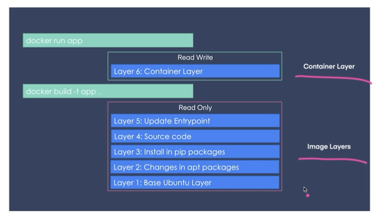
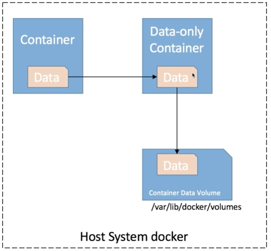
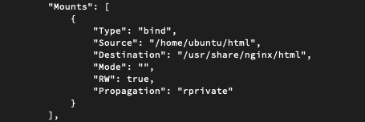

## docker 레이어 아키텍처



- 기본적으로 image layer와 container layer로 나뉨
- image layer는 읽기 전용으로 이미지를 불러 사용하며 Dockerfile 명세를 기반으로 동작
- 컨테이너 상에서 새로운 파일을 작성한 경우 container layer에 파일을 작성하며 읽기/쓰기 가능
- container layer는 컨테이너 종료시 삭제 됨
- 컨테이너 상에서 영구적으로 사용하는 방법은 아래 3가지

## 호스트 볼륨

- 호스트 디렉토리를 컨테이너의 특정 경로에 마운트

```bash
# 호스트의 /opt/html 디렉토리를 nginx 의 웹 루트 디렉토리로 마운트
docker run -d -p 80:80 -v $(pwd)/html:/usr/share/nginx/html nginx

docker exec -it [container] bash

ls -al /usr/share/nginx/html

drwxrwxr-x 3 1000 1000 4096 May  9 10:47 .
drwxr-xr-x 3 root root 4096 Apr 20 10:43 ..
**-rw-rw-r-- 1 1000 1000   15 May  9 10:47 helo.html**
drwxr-xr-x 2 root root 4096 May  9 10:47 html

touch hello

exit

ls -al $(pwd)/html

drwxrwxr-x 3 ubuntu ubuntu 4096 May  9 10:50 ./
drwxr-x--- 9 ubuntu ubuntu 4096 May  9 10:47 ../
**-rw-r--r-- 1 root   root      0 May  9 10:50 hello**
-rw-rw-r-- 1 ubuntu ubuntu   15 May  9 10:47 helo.html
drwxr-xr-x 2 root   root   4096 May  9 10:47 html/
```

## 볼륨 컨테이너

- 특정 컨테이너의 볼륨 마운트를 공유
- 아래 data-only container 가 볼륨 컨테이너라고 생각하면 됨
- 볼륨 컨테이너만 만들고 아무것도 하지 않음
- 볼륨 컨테이너만 참고하여 데이터 공유



```bash
docker run -d --name my-volume -it -v /opt/html:/usr/share/nginx/html ubuntu:focal

# my-volume 컨테이너 볼륨을 공유
docker run -d --name nginx --volumes-from my-volume nginx
```

```bash
docker run -d -it -v ~/html:/usr/share/nginx/html --name web-volume ubuntu:focal
docker run -d --name f-nginx --volumes-from web-volume -p 8080:80 nginx
docker run -d --name f-nginx2 --volumes-from web-volume -p 80:80 nginx
```

```bash
docker inspacet f-nginx
```



## 도커 볼륨

- 도커가 제공하는 볼륨 관리 기능을 활용하여 데이터 보존
- 기본적으로 /var/lib/docker/volumes${volume-name}/_data에 데이터 저장
- 최근 가장 많이 사용

```bash
# web-volume 도커 볼륨 생성
docker volume create --name db

# volume 목록 확인
docker volume ls

# docker web-volume 볼륨을 nginx의 웹 루트 디렉토리로 마운트
docker run -d --name f-mysql -v db:/var/lib/mysql -p 3306:3306 mysql:5.7
```

## 읽기 전용 볼륨 연결

- 볼륨 연결 설정에 :ro 옵션을 통해 읽기 전용 마운트 옵션을 설정
- 변경이 되서는 안되는 디렉토리나 static 파일들이 있는 경우 사용

```bash
docker run -d --name nginx -v web-volume:/usr/share/nginx/html**:ro** nginx
```

#docker 