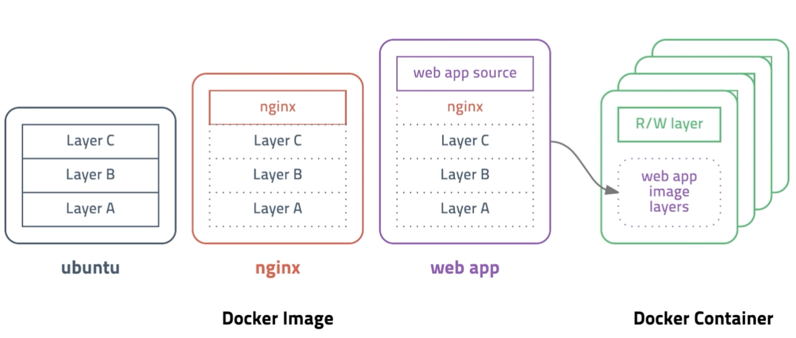
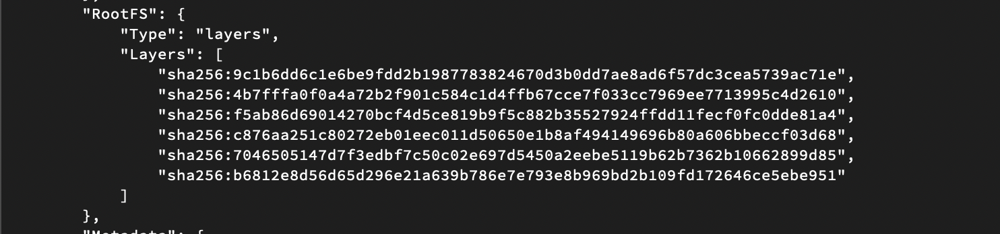
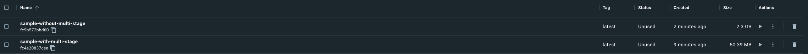

## 도커 이미지 구조



- 샘플 구조로 nginx 는 ubuntu 기반으로 만들어지고 web app은 nginx 기반으로 만들어져 있음
- 웹엡 이미지 기반의 컨테이너를 생성하게 되면 웹엡 이미지가 이미지 레이어라는 형태로 컨테이너가 실행될때 복사가 되고 해당 레이어는 읽기 전용 레이어로 생성되고, 컨테이너가 생성될 때 마다 컨테이너 레이어에 읽기쓰기가 가능한 레이어로 생성 된다.
- 컨테이너가 종료되어 삭제 되면 컨테이너 레이어는 같이 삭제된다.

```bash
# 호스트 운영체제 로컬에 보관되고 있는 이미지 목록 출력
docker images

# 도커 이미지 레이어 확인
docker inspect nginx
```



## Dockerfile 없이 이미지 생성

- 기존 컨테이너를 기반으로 새 이미지를 생성

```bash
# docker commit [OPTIONS] CONTAINER [REPOSITORY[:TAG]]
# ubuntu 컨테이너의 현재 상태를 my_ubuntu:v1 이미지로 생성
docker commit -a fastcampus -m "First Commit" ubuntu my_ubuntu:v1
```

- Dockerfile 없이 이미지 생성 하는 방법
- 기존 컨테이너에서 변경사항을 기반으로 새로운 이미지 생성 가능

```bash
# docker container 실행
docker run -it --name my_ubuntu ubuntu:focal

# 변경사항 발생
cat > my_file
Hello my file

# ctrl + c : 파일 작성 종료
# ctrl + p, q : 컨테이너 실행 상태로 내비두고 나오기

# docker image build (-a : 변경점을 누가 남기는지, -m 커밋 메시지 )
docker commit -a fastcampus -m "Add my file" my_ubuntu my-ubuntu:v1

# docker image 확인
docker images

REPOSITORY                    TAG       IMAGE ID       CREATED         SIZE
**my-ubuntu                     v1        5b2d7c30f135   4 seconds ago   72.8MB**
grafana/grafana               latest    c876b1dbac21   6 days ago      286MB
ubuntu                        focal     53df61775e88   10 days ago     72.8MB
mysql                         latest    96d0eae5ed60   12 days ago     524MB
nginx                         latest    fa5269854a5e   2 weeks ago     142MB
gcr.io/k8s-minikube/kicbase   v0.0.30   1312ccd2422d   3 months ago    1.14GB
```

- ubuntu:focal layer


- my-ubuntu layer


## Dockerfile 이용하여 이미지 생성

- Dockerfile을 기반으로 새 이미지 생성

```docker
FROM node:12-alpine
RUN apk add --no-cache python3 g++ make  
WORKDIR /app
COPY . .
RUN yarn install --production
CMD ["node", "src/index.js"]
```

- Dockerfile이 준비 되면 docker build 명령어로 빌드를 진행할 수 있음

```bash
# docker build [OPTIONS] PATH
# ./ 디렉토리를 빌드 컨텍스트로 my_app:v1 이미지 빌드 (Dockerfile 이용)
docker build -t my_app:v1 ./

# ./ 디렉토리를 빌드 컨텍스트로 my_app:v1 이미지 빌드 (example/MyDockerfile 이용)
docker build -t my_app:v1 -f example/MyDockerfile ./
```

- 빌드 옵션
    - -t : 태그의 약자로 빌드한 이미지에 대해 태그를 지정
    - -f : 도커파일의 경로를 나타냄, 기본적으로는 현재 경로의 Dockerfile 참조

## 빌드 컨텍스트

- 도커 빌드 명령 수행시 현제 디렉토리를 의미
- 해당 디렉토리의 정보가 모두 도커 엔진으로 전달 됨
- 사이즈가 커지면 느려짐
- 이러한 문제를 해결하기 위해 .dockerignore 제공

# .dockerignore

- 특정 디렉토리나 파일을 제외하기 위해 사용
- 자세한건 공식문서 확인!

```bash
# comment
*/temp*
*/*/temp*
temp?

*.md
!README.md
```

## Dockerfile 문법

[https://docs.docker.com/engine/reference/builder](https://docs.docker.com/engine/reference/builder)

### Format

```docker
# 주석
# 지시어 인자값 으로 이뤄져 있음
```

### Environment

```docker
FROM busybox
ENV FOO=/bar
WORKDIR ${FOO}
ADD . $FOO
COPY \\$FOO /quux
```

- 주의해야할 점 : WORKDIR, ADD의 FOO 환경 변수는 container의 환경 변수
- 이미지 빌드 단계에서 ENV 지시어를 이용하여 환경변수 주입 가능

### ARG

- ARG 지시어를 이용해서 build argument 를 전달

#### Default value

```docker
FROM busybox
ARG user1=someuser 
ARG buildno=1

```

#### Build Argument

```bash
docker build --build-arg IMG_VER=v2.1.0
```

- —build-arg 이용
- 사용하기 전에 반드시 ARG 지시어 정의 해 놔야함
- ARG와 ENV가 동일한 키워드를 가지는 경우 ENV가 덮어 쓴다.

### 지시어

```docker
# 항상 이거로 시작, base image 
FROM node:16 

# 이미지의 메타 데이터
LABEL maintainer="FC" 

# 다음에 오는 경로를 워킹 디렉토리로 만듬 cd ${workdir} 로 생각하면 편함
WORKDIR /app 

# COPY SRC DEST -> SRC : Host os path, DEST : image path
# 이 경우 /app 디렉토리를 가리킨다.
# 패키지 설치 단계를 레이어로 구성하기 위해서 분리
COPY package*.json ./ 

# docker image build 상에서 해당 명령어를 실행
# package*.json 을 읽어서 npm install 진행
RUN npm install 

# 현재 디렉토리 상의 모든 파일을 이미지 경로에 복사 해라 
COPY . .

# EXPOSE [PORTNUM] : 이 이미지가 8080 포트를 사용한다고 문서화
# 퍼블리싱 할 경우 -p 옵션을 줘야 함
EXPOSE 8080

# 컨테이너를 실행할때 어떤 명령어를 실행할지 결정
# 배열 또는 하나의 문자열로 전달 가능
# CMD "node server.js" 
CMD ["node", "server.js"]
```

#### ENTRYPOINT

- 컨테이너가 시작될 때 항상 실행할 명령어를 지정한다.
- docker run 명령을 통해 컨테이너를 실행할 때 추가 인자로 덮어쓸 수 없다.(이게 가장 큰 다른점이다.)

```docker
ENTRYPOINT ["executable", "p1", "p2"]
ENTRYPOINT "executable p1 p2"
```

이 부분은 CMD 지시어와 비슷하면서도 다르다 자세한거는 아래 링크를 확인하자.
> https://mvje.tistory.com/170

#### ADD

- COPY 지시어와 거의 동일
- 차이점은 url 도 사용 하지만 src 값이 변경 됐는지 확인이 힘들어 사용을 지양

#### USER

- docker container가 사용할 기본 사용자 지정
- 그룹 또한 지정 가능

```docker
USER <user>[:<group>]
USER <UiD>[:<GID>]
```

그 외에도 많이 있지만 자세힌건 docs 확인해볼것


## Docker Image Build 경량화 전략

### 꼭 필요한 패키지 및 파일만 추가

- 컨테이너는 하나의 프로세스를 실행하는것에 초첨이 맞춰저 있어 프로세스를 실행하는데 필요한 것만 추가

### 컨테이너 레이어 수 줄이기

- Dockerfile 내에서 지시어의 수를 줄이게 되면 컨테이너의 레이어가 줄어들게 됨
- RUN 지시어가 여러번 등장하게 되면 하나의 RUN 지시어로 통합

### 경량 베이스 이미지 선택

- 대표적으로 debian slim 또는 alpine, stretch(파일 시스템만 존재) 같인 것만 사용

### 멀티 스테이지 빌드 사용

- 빌드 스테이지와 릴리즈 스테이지를 나눠서 빌드에 필요한 빌드 의존성은 빌드 스테이지에서 진행하고 릴리즈스테이지에서는 빌드 이미지만 복사해서 사용

### 실습

#### 레이어 수 줄이기

```docker
#
# slacktee
#
# build:
#   docker build --force-rm -t slacktee .
# run:
#   docker run --rm -it --name slacktee slacktee
#

FROM alpine:3.14
LABEL maintainer="FastCampus Park <fastcampus@fastcampus.com>"
LABEL description="Simple utility to send slack message easily."

# Install needed packages
# && 를 이용하여 명령어를 같이 실행 - 하나의 레이어로 합침
# docker image 상에서는 패키지에 대한 캐시를 필요로 하지 않음
# 캐시를 남겨두게 되면 이미지 용량이 커지게 되고 --no-cache 같은 옵션을 확인해서 캐시를 남기지 않고불필요한 캐시를 삭제
RUN \\
  apk add --no-cache bash curl git && \\
  git clone <https://github.com/course-hero/slacktee> /slacktee && \\
  apk del --no-cache git
RUN chmod 755 /slacktee/slacktee.sh

# Run
WORKDIR /slacktee
ENTRYPOINT ["/bin/bash", "-c", "./slacktee.sh"]
```

#### 경량 이미지 선택

```docker
FROM node:16**-alpine**
...
```

#### 멀티 스테이지 파이프라인

```docker
# base block
FROM node:16-alpine AS base
COPY package.json .
COPY yarn.lock .

RUN yarn

# build block
FROM base as build
COPY index.html .
COPY .env .  
COPY ./src ./src
RUN yarn build

# release block
FROM nginx:stable-alpine

# build 스테이지에서 파일 복사
# --from 옵션으로 특정 스테이지에서 파일을 복사해 올 수 있음
COPY --from=build ./dist /var/www/html
COPY ./nginx/nginx.conf /etc/nginx/nginx.conf

CMD ["nginx", "-g", "daemon off;"]
```

1. 먼저 multi stage 를 이용해서 base 스테이지에서 필요한 node_modules 를 설치한다.
2. build 스테이지에서 먼저 선행된 base 스테이지를 이용해 yarn build 한다.
	- 이경우 나누지 않아도 되나 base image 의 변경점을 줄이고 build 스테이지에서만 가벼운 동작을 실행시키므로써 base block을 다시 빌드하지 않도록 했다.
3. build block 에서 나온 dist 를 release block 에 전달하여 실행한다.

이렇게 하면 이미지 빌드 시간은 실제 프로젝트 빌드하면서 변경 가능성이 있는 src 이후에서만 다시 동작하게 되며, release block 에서는 필요한 파일만 갖게 되므로(node_modules 를 미포함 시킨다) 이미지의 경량화를 할 수 있다.



위 이미지를 보면 sample-without-multi-stage 이미지는 2.3GB가 되고, sample-with-multi-stage 는 50.39MB 가 되는것을 확인할 수 있다. 
이 것은 node_modules 의 차이가 크다고 볼 수 있다. 