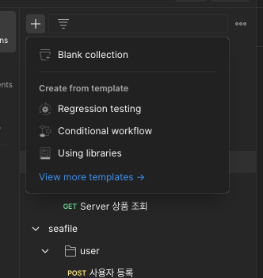
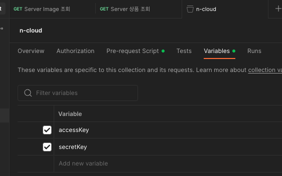

### 사전 작업

#### 1. Collection 생성
- 새로운 컬랙션을 만든다.




#### 2. Pre-Script 작성

- Collection 의 Pre-request Script 를 작성한다.

``` javascript
var url = pm.request.url.getPath().trim();
var params = pm.request.url.query.all().forEach((param) => {

var startQueryString = true;
	if (startQueryString == true) {
		url += `?${param.key}=${param.value}`
		startQueryString = false;
	} else {
		url += `&${param.key}=${param.value}`
	}
});

  
  

var method = pm.request.method.trim();
var timestamp = new Date().getTime() + "";
var space = " "; // one space
var newLine = "\n"; // new line
var accessKey = pm.collectionVariables.get("accessKey");
var secretKey = pm.collectionVariables.get("secretKey");

var message = method + space + url + newLine + timestamp + newLine + accessKey;

var hmac = CryptoJS.HmacSHA256(message, secretKey);
var signature = hmac.toString(CryptoJS.enc.Base64);

pm.collectionVariables.set("timestamp", timestamp);
pm.collectionVariables.set("signature", signature);

pm.request.addHeader({ key: "x-ncp-apigw-signature-v2", value: signature });
pm.request.addHeader({ key: "x-ncp-iam-access-key", value: accessKey });
pm.request.addHeader({ key: "x-ncp-apigw-timestamp", value: timestamp });

```

#### 3. Collection Variables 등록 


- Variables 에 accessKey 를 등록하고 accessKey, secretKey 의 값을 초기화 한다.
- 주의 : Current value 에 값이 들어가 있어야 한다.

### 요청

#### Request 생성

Collection 하위에 Request 를 생성하고 아래 샘플에 맞춰 요청을 보내면 끝이다.

[샘플 1]
아래는 서버 이미지 코드를 조회하는 예시 샘플이다.

- https://ncloud.apigw.ntruss.com/vserver/v2/getServerImageProductList

[샘플 2]
아래는 서버 상품 코드를 조회하는 예시 샘플이다.

- https://ncloud.apigw.ntruss.com/vserver/v2/getServerProductList?serverImageProductCode=SW.VSVR.OS.LNX64.CNTOS.0703.B050

위 pre-script 가 자동으로 header 셋팅을 해주기 때문에 별도의 변경 없이 사용하며 Ncloud API 호출이 가능하다.

따라서, NCloud API 의 필수값만 잘 넣어주면 문제없이 동작하게 된다.