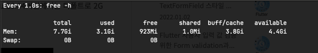
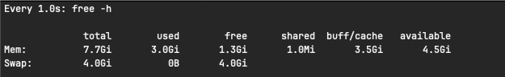

### Swap 메모리란

실제 메모리(RAM) 이 가득 차 더이상 사용 불가하지만 더 많은 메모리가 필요로 할 때 디스크 공간을 이용하여 부족한 메모리를 대체할 수 있는 공간으로 윈도우의 가상 메모리라 생각하면 편하다.

실제 메모리가 아닌 디스크를 사용하는 것이기 때문에 메모리 속도면에서는 떨어지나 프로세스의 안정성을 위해 swap 메모리를 사용하여 적은 메모리로도 여러 프로세스를 띄우는게 가능하다.

### Ubuntu 20.04 Swap 

#### SWAP 파일 확인 
```shell
$ ll / | grep swap # swap 파일이 있는지 확인
$ free -h 
$ swapon -s # swapfile 위치까지 알려줌
```



#### Swapfile 사이즈 조정
```shell
# swap 이 이미 할당되어있는 경우 swapoff 를 이용하여 비활성화 한다.
$ sudo swapoff -v /swapfile

# fallocate 명령어를 이용하여 swap 메모리 생성
$ sudo fallocate -l 4G /swapfile 

# 권한 설정
$ sudo chmod 600 /swapfile

# swapfile 만들기
$ sudo mkswap /swapfile 

# swapfile 활성화 (reboot 하지 않아도 활서오하 됨)
$ sudo swapon /swapfile

# swapfile 마운트
$ sudo vim /etc/fstab

/swapfile none   swap    sw      0       0 # 추가

# sudo echo '/swapfile none swap sw 0 0' | sudo tee -a /etc/fstab
# 위 명령어도 동일한 결과를 기대할 수 있다.

# 결과 확인
$ free -h 
```



### 참고
https://jw910911.tistory.com/122 (여기는 설명이 상세하다.)
https://jaykos96.tistory.com/13
https://ssue-dev.tistory.com/entry/Linux-Swap-Memory-%EC%8A%A4%EC%99%91-%EB%A9%94%EB%AA%A8%EB%A6%AC-%EC%84%A4%EC%A0%95-%EB%B0%A9%EB%B2%95 (좀더 고급 활용을 볼 수 있다)


rocky os : https://oops4u.tistory.com/2542