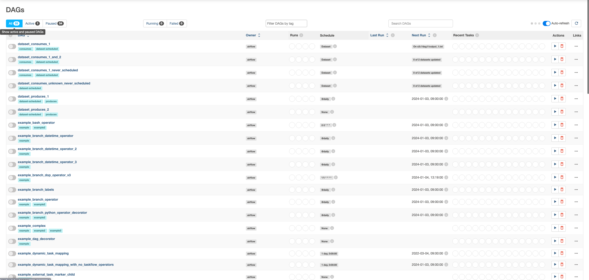

### Airflow ? 

Airflow 는 초기 에어비엔비 엔지니어링 팀에서 개발한 워크플로우 오픈소스 플랫폼이다.

먼저 공식문서에 어떻게 나와있는지 작성해보자.

> [Apache Airflow™](https://github.com/apache/airflow) is an open-source platform for developing, scheduling, and monitoring batch-oriented workflows. Airflow’s extensible Python framework enables you to build workflows connecting with virtually any technology. A web interface helps manage the state of your workflows. Airflow is deployable in many ways, varying from a single process on your laptop to a distributed setup to support even the biggest workflows.

위의 영문장은 공식문서에 적혀있는 있는 Airflow 에 대한 설명이다. 이것을 해석하면 아래와 같이 해석할 수 있겠다.

> 개발과 스케쥴링 그리고 배치기반 워크플로우의 모니터링을 위한 오픈소스 플랫폼으로 확장가능한 Python Framework 를 사용하면 거의 모든 기술과 연결괴는 워크플로우를 구축할 수 있습니다.
> 웹 인터페이스는 당신의 워크플로우의 상태를 관리하는데 도움을 줄 수 있으며, 당신의 노트북의 단일 프로세스 부터 가장 큰 워크플로우를 지원하는 분산 처리 설정까지 다양한 방식으로 배포할 수 있습니다.

워크플로우는 일련의 작업(Task) 의 흐름을 나타내고 이를 관리하기 위한 Tool 이 바로 airflow 이다.

- 워크플로우의 작성(개발)
- 워크플로우의 스케쥴링
- 워크플로우의 모니터링

이러한 airflow 는 데이터 엔지니어링 영역에서 또한 많이 사용하고 있는 추세이다.

### Workflows as code (코드로서의 워크플로우)

먼저 주요 특징에 대해 알아보자 

> 모든 워크플로우는 `Python` 으로 정의되며 코드로서 워크플로우는 여러 목적으로 사용한다.

- `Dynamic`: Airflow 의 파이프라인들은 Python Code 로 구성되며, 동적인 파이프라인 생성이 가능하다.
- `Extensible`: Airflow framework 는 많은 기술과 연결하는 연산자가 포함되어 있으며, 모든 Airflow 구성요소는 확장가능하여 환경에 맞게 쉽게 조정이 가능하다.
- `Flexible`: `Jinja Templage Engine` 을 활용하여 워크플로우 매개변수화가 내장되어 있다.

먼저 아래 코드를 작성해보자. 

```python
from datetime import datetime

from airflow import DAG
from airflow.decorators import task
from airflow.operators.bash import BashOperator

# A DAG represents a workflow, a collection of tasks
with DAG(dag_id="demo", start_date=datetime(2023, 1, 1), schedule="0 0 * * *") as dag:
	# Tasks are represented as operators
	hello = BashOperator(task_id="hello", bash_command="echo hello")
	
	@task
	def airflow():
		print("airflow")

	# Set dependencies bewteen tasks
	hello >> airflow()
```


위 코드를 분석해보자

- 2023년 1월 1일부터 매일 0시 0분에 한 번 실행되는 `demo` 라는 이름의 `DAG`를 생성한다.
- `BashOperator` 를 이용하여 실행하는 `Bash Script` 작업과, `@task` 데코레이터를 사용한 Python function 을 지정하였다.
- `>>` 연산자를 이용해 작업간의 종속성을 정의하고 작업이 실행되는 순서를 제어한다.
	- `hello bash script` 가 실행된 다음 `airflow task` 가 실행되도록 지정

> **DAG** : `Task` 의 모음인 워크플로우를 나타낸다. 설명하자면 작업의 정의와 순서를 제어하기 위한 워크플로우를 정의한 것이라고 생각하면 된다.


이렇게 `DAG` 를 작성하고 `airflow-webserver` 로 접속하면 아래와 같은 그래프를 확인할 수 있다.



### 어디에 사용한다.

Airflow 는 일괄 워크플로우 조정 플랫폼으로, 다양한 기술과 연결하는 연산자가 포함되어 있으며, 새로운 기술과 연결하기 쉽게 확장할 수 있다. 워크플로우의 시작과 끝이 명확하며, 정기적으로 실행되는 경우 Airflow DAG 로 프로그래밍할 수 있다. 

클릭을 이용하기보다는 코딩을 이용한 워크플로우를 정의한다면 적합한 도구이다. 

- Python 코드로 정의되므로 SCM 을 이용하며 버전 관리가 가능하다.
- 여러사람이 동시에 워크플로우를 개발할 수 있다.
- 기능을 검증하기 위한 테스트를 작성할 수 있다.(TDD 또는 테스트 코드)
- 구성요소는 확장가능하며, 다양한 기존 구성 요소 모음을 기반으로 구축할 수 있다.


### Operators 

### 참고
[꿈 많은 사람의 이야기 - Apache Airflow 시작하기 - Airflow란? 설치 및 기본 예제](https://lsjsj92.tistory.com/631)