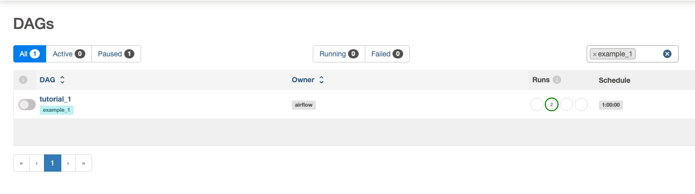
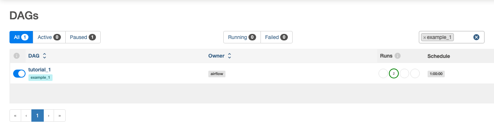
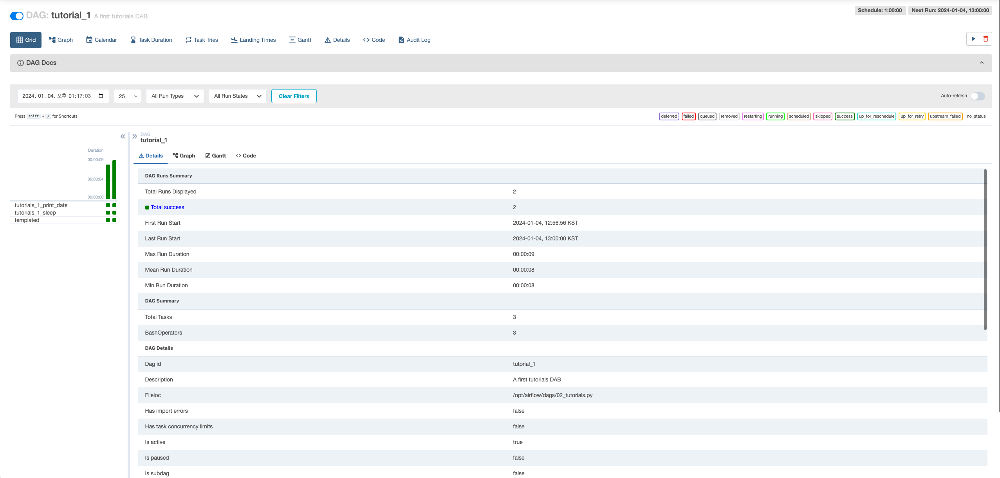
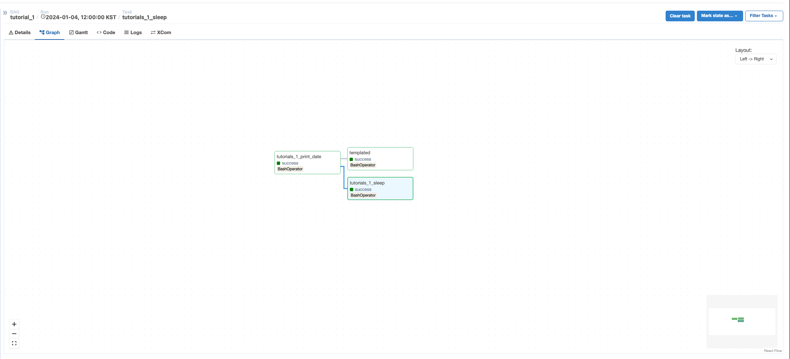
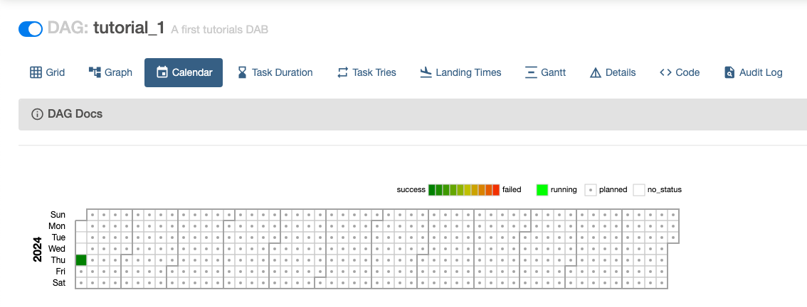
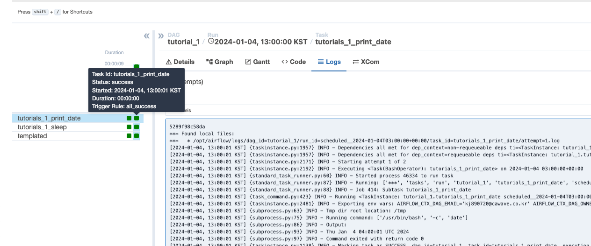
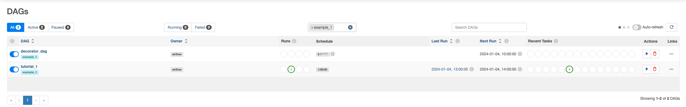
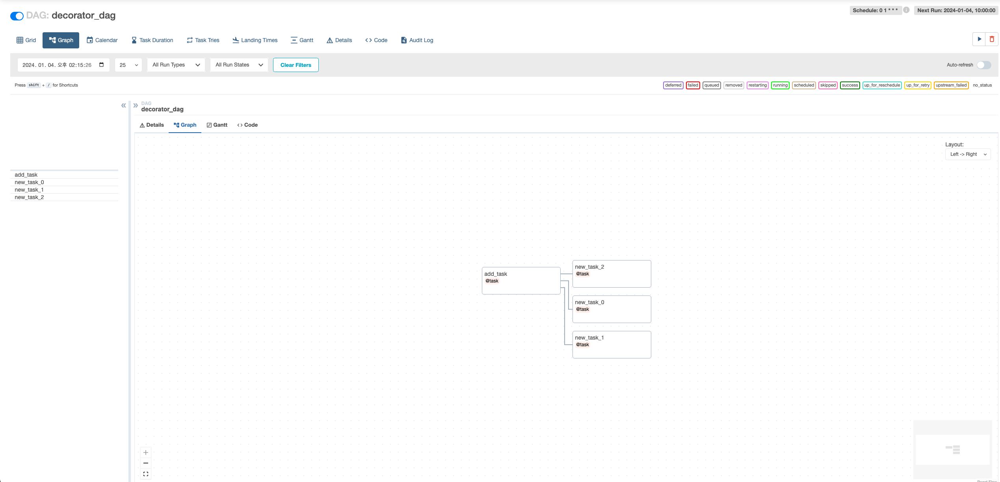

먼저 간단한 에어플로우 DAG 작성법과 개념, 및 Airflow python 라이브러리 사용법을 알아보자

### Example pipeline using python 

```python 
import textwrap

from datetime import timedelta, datetime as dt 

from airflow.models.dag import DAG
from airflow.operators.bash import BashOperator

def __get_dag_parameters(index :int = 0, **values) -> dict:
    dag_tutorials = {
        'dag_id': f'tutorial_{index}',
        'default_args': {
            'depens_on_past': False,
            'email': 'kj890720@cawave.co.kr', 
            'email_on_failure': True, 
            'email_on_retry': False, 
            'retries': 1,
            'retry_delay': timedelta(minutes=5)
        },
        'description': 'A first tutorials DAB', 
        'schedule': timedelta(hours= 1), 
        'start_date': dt(2024, 1, 4),
        'catchup': False, 
        'tags': [f'example_{index}']
    }
    
    if values is not None:
        dag_tutorials.update(values)
    
    return dag_tutorials


with DAG(**__get_dag_parameters(1)) as tutorials_1:
    
    ###############################
    # NOTE: Task 생성              #
    # - bash command 실행          #
    bash_command_1 = BashOperator(
        task_id="tutorials_1_print_date",
        bash_command="date"
    )
    
    bash_command_2 = BashOperator(
        task_id= "tutorials_1_sleep", 
        bash_command= "sleep 5", 
        retries= 3,
    )
    
    ########################################
    # NOTE: Task 의 문서(설명 같은 거) 작성      #
    # - 이 doc_md 는 markdown 문법을 사용해야 함 #
    bash_command_1.doc_md = textwrap.dedent('''#### Task Documentation 
                        ##### Markdown 문법 공부하세요
                        1. 마크다운 문법을 찾는다.
                        2. 공부한다.
                        - 깃에 공유한다.''')
    

    tutorials_1.doc_md = __doc__
    tutorials_1.doc_md = """
    This is a documentation placed anywhere
    """  # otherwise, type it like this 
    
    templated_command = textwrap.dedent(
        """
    
        echo "{{ ds }}"
        echo "{{ macros.ds_add(ds, 7)}}"
    
    """
    )
    
    bash_command_3 = BashOperator(
        task_id="templated",
        depends_on_past=False,
        bash_command=templated_command,
    )
    
    bash_command_1 >> [ bash_command_2, bash_command_3]
        
    
```

위 코드는 간단한 bash command 를 실행하기 위한 예제이다. 

`with DAG():` 를 이용해서 DAG 를 open 하고 `BashOperator` 를 이용해 `bash command` 를 실행한다. 이 때 `task_id` 값을 이용해 작업의 ID 를 설정할 수 있다.

이렇게 작성한 `DAG` 는 Airflow 관리 웹 에서 확인이 가능하며 활성화 해야 동작을 한다.

> 맨 처음 DAG 의 목록은 Airflow 에서 기본 제공하는 목록으로 가득 차있는데 우리가 만든 DAG 를 쉽게 찾기 위해 `example_1` 태그를 추가해놨다. 



해당 DAG 의 좌측에 있는 토글을 이용해서 DAG 를 활성화 할 수 있다
- 동작시키기 위해서는 필수로 활성화 해야 한다.



여기서 목록에 대한 설명을 잠깐 하고 넘어가자

| colume | description |
| ---- | ---- |
| DAG | DAG 이름이 나온다. |
| Owner | DAG 의 소유자 이다. |
| Runs | 이전 실행 정보들의 숫자가 나오며 실패, 성공, 대기, 실행중인 숫자가 나온다. |
| Schedule | 일정에 대한 정보가 나오며, deltatime 을 통한 주기, 자체 cron 문법을 통한 주기 작성이 가능하다. |
| Last Run | 마지막 실행 시간이다. |
| Next Run | 다음 실행 시간이다. |
|  |  |
| Recent Tasks | 모든 활성화 된 DAG 의 실행정보 또는 비활성화 된 DAG 의 최근 실행 결과를 보여준다. |
| Actions | 실행, DAG 삭제 등을 할 수 있다. |
| Links | 그 외 DAG 의 상세화면에서 볼 수 있는 TAB 으로 이동할 수 있는 버튼들이 있다. |

> 주의 : DAG 를 삭제하여도 `dags` 디렉토리 하위에 python 파일로 DAG 가 등록되어 있으면 다시 DAG 목록에 등록된다.

#### DAG 상세 화면

DAG 에 대한 상세 정보로 실행 시간, 결과, 요약정보 등 다양한 정보를 확인할 수 있다.




#### DAG Graph

DAG 의 작업 목록을 Graph 형태로 볼 수 있다.



#### DAG Calendar

DAG 가 실행한 날자 정보를 Calendar 형태로 확인 가능하다.



#### DAG Logs

좌측에 보이는 네모(처리 결과에 따라 색이 다름)를 클릭하면 `Logs` 탭이 활성화 되고 그곳에서 처리 결과를 확인할 수 있다.




### Airflow Decorator

Airflow 는 `Python Decorator` 를 이용한 정의 또한 가능하다. 이를 위한 `Decorator` 에는 `@task`, `@dag` 가 있다.

```python
from airflow.decorators import dag, task
from datetime import datetime

# NOTE: TASK 의 선언
@task
def add_task(x, y):
    print(f"Task args: x={x}, y={y}")
    return x + y
    
# NOTE: DAG 의 선언    
@dag(dag_id='decorator_dag', start_date=datetime(2024, 1, 4), schedule="0 1 * * *")
def use_add_task():
    start = add_task.override(property_weight=3)(1,2)
    
    for i in range(3):
        start >> add_task.override(task_id=f'new_task_{i}', retries=4)(start, i)
        
        
created_dag = use_add_task()

```

위 코드의 결과로 아래와 같이 등록된 것을 확인할 수 있다.



