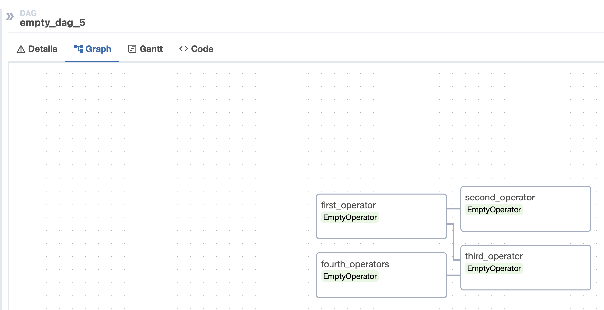
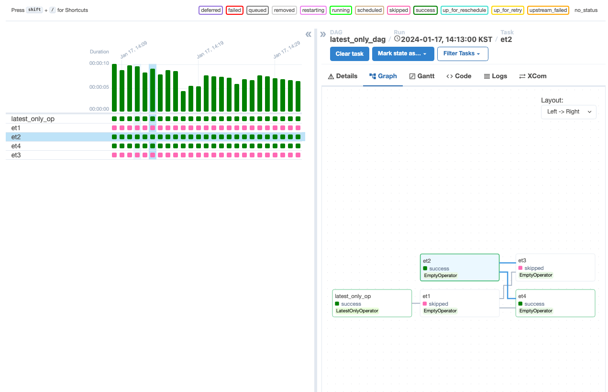

이번에는 `Airflow` 에서 사용하는 용어와 그 용어에 해당하는 파이썬 코드에 대해서 한 번 정리해보겠다.
## DAG 의 선언

`Directed Acyclic Graph` 은 직역(구글번역기) 하면 `방향성 비순환 그래프`를 의미한다. 

> [방향성 비순환 그래프](https://academy.gopax.co.kr/banghyangseong-bisunhwan-geuraepeu-dag-ran-mueosingayo/) : 일종의 데이터 구조로 순환하지 않고 일정한 방향성을 갖는다. 결국 특정 지점 에서 그래프를 따라간다면 동일한 지점으로 돌아갈 수 없다. 자세한건 링크를 타고 들어가서 확인해보자

`DAG` 는 Python 으로 구현되며, 내부에 Task 들의 집합을 가지며 선언은 아래와 같은 방법들로 한다.

```python
from datetime import datetime
from airflow import DAG
from airflow.operators.empty import EmptyOperator

tags= ['example_2']

# with 문과 같이 사용하는 DAG
start_datatime = datetime(2024, 1, 12)
with DAG(dag_id= 'empty_dag', start_date= start_datatime, schedule='@daily', tags= tags):
    EmptyOperator(task_id='empty_task')
    
# 표준 생성자를 이용한 DAG
my_dag = DAG(dag_id='empty_dag_2', start_date=start_datatime, schedule='@daily', tags= tags)
EmptyOperator(task_id='my_dag_task_1', dag= my_dag)

# 데코레이터를 이용한 DAG
from airflow.decorators import dag
@dag(dag_id='empty_dag_3', start_date=start_datatime, schedule='@daily', tags= tags)
def generate_dag():
    EmptyOperator(task_id='task')
    
generate_dag()
```

DAG 는 실행할 작업이 있어야하며 일반적으로 Operators, Sensors, TaskFlow 형식으로 제공된다

> <b>DAG 의 구성 참고</b>
> [1. Airflow Operators](https://airflow.apache.org/docs/apache-airflow/stable/core-concepts/operators.html)
> [2. Ariflow Sensors](https://airflow.apache.org/docs/apache-airflow/stable/core-concepts/sensors.html)
> [3. Airflow TaskFlow](https://airflow.apache.org/docs/apache-airflow/stable/core-concepts/taskflow.html)

### 작업의 종속성

작업은 일반적으로 혼자 구성되지 않으며, 다른 작업에 종속(upstream)되며 다른 작업은 이 작업에 종속(downstream) 된다. 이는 `>>` 또는 `<<` 연산자를 이용해 표현되며, 권장되는 방법이다.

```python
with DAG(dag_id='empty_dag_4', **dag_value):
    first_operator = EmptyOperator(task_id='first_operator')
    second_operator = EmptyOperator(task_id='second_operator')
    third_operator = EmptyOperator(task_id='third_operator') 
    fourth_operator = EmptyOperator(task_id='fourth_operators')
    
    # secnod_operator 는 first_operator 에 종속 : downstream
    first_operator >> [second_operator, third_operator]
    
    # fourth_operators 는 third_operter 에 종속 : upstream
    third_operator << fourth_operator
```

위 코드의 Tasks Graph 는 아래와 같다


`set_upstream` 또는 `set_downstream` 을 이용하여 보다 명시적으로 표시할 수 있다

```python
with DAG(dag_id='empty_dag_5', **dag_value):
    first_operator = EmptyOperator(task_id='first_operator')
    second_operator = EmptyOperator(task_id='second_operator')
    third_operator = EmptyOperator(task_id='third_operator') 
    fourth_operator = EmptyOperator(task_id='fourth_operators')
    
    # secnod_operator 는 first_operator 에 종속 : downstream
    first_operator.set_downstream([second_operator, third_operator])
    
    # fourth_operators 는 third_operter 에 종속 : upstream
    third_operator.set_upstream(fourth_operator)
    
```

위 코드의 Tasks Graph 는 아래와 같다



위, 아래 사진을 보면 동일한 결과가 나왔다는것을 확인하였다. 

- `>>` : downstream
- `<<` : upstream 

이렇게 구성된 작업은 의존관계에 엮여 `second_operator`, `third_operator` 은 `first_operator` 가동작을 완료한 다음 동작할 수 있다. 
또한, `fource_operator` 가 완료되야 `thrid_operator` 가 동작할 수 있다.

> 참고. 나도 학습하면서 정리하는것이기 때문에 정확한 동작 순서는 아직 파악이 안되었다. 이 부분은 조금더 큰 사이즈의 task 를 작성해 보면서 동작 순서를 한 번 다시 정리가 필요하다.

위 `upstream` 과 `downstream` 보다 더 복잡한 `corss_downstream`, `chain` 이 존재한다.

먼저 `cross_downstream` 의 선언 방법이다.

```python 
from airflow.models.baseoperator import cross_downstream
# [op1, op2] >> op3
# [op1, op2] >> op4

cross_downstream([op1, op2], [op3, op4])
```

다음은 `chine` 이다. 

```python
from airflow.models.baseoperator import chain
# op1 >> op2 >> op4 >> op6
# op1 >> op3 >> op5 >> op6

chain(op1, [op2, op3], [op4, op5], op6)
```

chain 은 쌍으로 종속선을 선언한다.

## DAG 로드

DAG 는 기본적으로 설정된 $DAG_FOLDER 에 작성된 Python 소스코드에서 DAG 객체를 로드된다. 즉, Python 파일 하나당 여러 DAG 를 정의할 수 있고, 복잡한 DAG 하나를 여러 Python 파일에 분산할 수 있다. 

DAG Loader 가 가져오지 않을 파일의 패턴은 `.airflowignore` 에 정의하면 해당 패턴에 일치하는 DAG 는 수집하지 않는다.

> [DAG .airflowignore](https://airflow.apache.org/docs/apache-airflow/stable/core-concepts/dags.html#concepts-airflowignore)


## DAG 실행

DAG의 실행 방법은 두 가지가 있다. 

1. API 를 통한 수동 트리거
2. 일정에 따른 트리거

DAG 선언시 schedule 값을 이용해서 일정에 따라 동작시킬 수 있으며 아래의 방법들로 동작시킬 수 있다. 

#### Cron Preset

```python
# preset 은 아래 표 확인
with DAG(dag_id='sam', schedule=f'{preset}'):
	pass
```

| Preset | Meaning | Cron |
| ---- | ---- | ---- |
| None | 스케줄에 따라  실행하지 않고 외부에서 트리거 |  |
| @once | 단 한번만 실행한다. |  |
| @continuous | 이전 실행이 완료 되자마자 바로 실행 |  |
| @hourly | 매 시간마다 한 번씩 실행 | `0 * * * *` |
| @daily | 하루에 한 번 자정에 실행 | `0 0 * * *` |
| @weekly | 주 1회 일요일 자정 실행 | `0 0 * * 0` |
| @monthly | 매월 1회 1일 자정 실행 | `0 0 1 * *` |
| @quarterly | 분기별 1회 첫날 자정 실행 | `0 0 1 */3 *` |
| @yearly | 일년에 한 번 1월 1일 자정에 실행 | `0 0 1 1 *` |

위 `preset` 들은 `schedule` 값에 string 형태로 주입되며 cron 형식으로 대체가 가능하다. 다음으로 timedelta 를 이용한 방식이 있다. 

#### datetime.timedelta

```python
# timedelta 를 이용한 스케쥴

from datetime import timedelta

# 1 분 마다 실행
with DAG(dag_id='sam', schedule=timedelta(minutes=1)): 
	pass
```

이 방법은 Cron Preset 에서 제공하지 않는 초, 분단위를 처리할때 유용하다.


## default_args

`DAG` 내부의 `Operators`에는 동일한 기본 매개변수 딕셔너리 (예: retries) 가 필요한 경우가 있다. 모든 `Operators`에 이를 개별적으로 지정하는 대신 `DAG`의 `default_args`를 이용하여 연결된 모든 연산자에 자동으로 적용된다.


```python
from datetime import datetime
from airflow.operators.bash import BashOperator

with DAG(dag_id='example3', start_date=datetime(2024, 1, 17), 
		schedule='@daily', default_args={'retries': 2}, tags=['example3']):
	op = BashOperator()
	print(op.retires) # 2

```

## 제어의 흐름

`DAG` 는 자신이 의존하는 모든 작업이 성공한 경우에만 작업을 실행하며, 이를 적용하는 방법에는 여러가지가 있습니다.
### Branching

`DAG`는 모든 종속된 작업을 실행하지 않도록 지시하기위해 `Branching` 을 사용할 수 있다. 대신에 처리될 하나이상의 경로를 선택할 수 있으며 `@task.branch` decorator 를 이용하여 분기처리를 하게 된다. 

`@task.branch` 는 `@task`와 둘 다 `DAG`에 작업을 정의하고 실행하기 위한 decorator 로 유사한 기능을 갖는다. 차이점으로 `@task.branch` 는 다음 작업을 실행하기 위한 `task_id` 를 반환한 다는 것이다. 이때 `None`을 반환하면 하위 모든 작업이 무시된다.

`@task.brach` 를 이용해 반환받은 `task_id` 는 `downstream`으로만 작업을 참조할 수 있다. 

* `Branch Operator` 를 이용해도 된다.

```python
default_params = {
	'start_date': datetime(2024, 1, 17), 
	'schedule': '@daily', 
	'tags': ['dag_controll_flow']
}

with DAG(dag_id='branch_dag', **default_params):
    @task.branch(task_id= 'branching')
    def  branch_function() -> str:
        import random
        return random.choice(['random_t1','random_t2','random_t3'])
    
    from airflow.operators.python import PythonOperator
    
    def common_func(**kwargs):
        print(kwargs['selected'])
    
    random_t1 = PythonOperator(
	    task_id='random_t1', 
	    python_callable=common_func, 
	    op_kwargs={'selected':'A'}
	)
    random_t2 = PythonOperator(
	    task_id='random_t2', 
	    python_callable=common_func, 
	    op_kwargs={'selected':'B'}
	)
    random_t3 = PythonOperator(
	    task_id='random_t3', 
	    python_callable=common_func, 
	    op_kwargs={'selected':'C'}
	)

    branch_function() >> [random_t1, random_t2, random_t3]
    
```

위 코드에 대한 처리 결과를 보면 random_t1,2,3가 무작위로 한가지만 실행된 것을 확인 할 수 있다. (녹색)


이처럼 `@task.branch`를 이용하면 조건에 따른 원하는 분기를 처리할 수 있다. 

> 기본적으로 `@task.branch` 는 downstream을 참조하지만 upstream 을 참조하기 위한 방법도 존재한다. `xcom` 을 이용한 방법인데 아래 링크를 참고하자
> 
> Ref: [xcom](https://airflow.apache.org/docs/apache-airflow/stable/core-concepts/xcoms.html), [branching](https://airflow.apache.org/docs/apache-airflow/stable/core-concepts/dags.html#branching)
> 


### Latest Only

> Ref : [남궁찬 깃 블로그 - airflow](https://getchan.github.io/data/airflow_2/)

일번직인 워크플로우는 특적 시간에 실행되거나 스케쥴에 맞게 실행된다. 이러한 경우 `backfill` 은 cpu를 낭비한다고 한다.

`LatestOnlyOperator`를 사용하면 가장 최근에 스케쥴된 dag 만 실행하므로 현재 시간이 `execution_time` 과 다음 스케쥴의 `execution_time` 사이가 아닌 경우 LatestOnlyOperator 는 모든 하위 task 를 스킵 한다.

```python
with DAG(dag_id='latest_only_dag', **default_params):
    from airflow.operators.latest_only import LatestOnlyOperator
    from airflow.operators.empty import EmptyOperator
    from airflow.utils.trigger_rule import TriggerRule
    latest_only_op = LatestOnlyOperator(task_id='latest_only_op')
    t1 = EmptyOperator('et1')
    t2 = EmptyOperator('et2')
    t3 = EmptyOperator('et3')
    t4 = EmptyOperator('et4', trigger_rule=TriggerRule.ALL_DONE)
    
    latest_only_op >> t1 >> [t3, t4]
    t2 >> [t3, t4]
```


1. `t1`은 `latest_only_op` 에 의존해있는 `downstream`이며 최신 실행을 제외한 모든 실행을 건너 뛴다.
2. `t2`는 `latest_only_op` 와 완전히 독립되어 예약된 스케쥴에 실행된다.
3. `t3`는 `t1`과 `t2`의 `downstream`이며 기본 `trigger rule`인 `all_success` 규칙을 따라 스킵 된다.
	- `t1` 은 스킵, `t2`는 실행 되었기 때문에 `all_success` 가 충족되지 않기 때문이다.
4. `t4`는 `t1`과 `t2`의 `downstream`이지만 `trigger rule`인 `all_done` 규칙을 따라 스킵되지 않는다.
	- `all_done` 은 모든 `upstream` 작업이 실행과 함께 완료 되는 규칙이다. 

> Ref : [Trigger Rule](https://airflow.apache.org/docs/apache-airflow/stable/core-concepts/dags.html#concepts-trigger-rules)



### Depends On Past

`DAG` 실행시 이전 task 의 실행이 성공한 경우에만 실행 가능하도록 할 수 있다. 

```python
default_args = {
    'depends_on_past': True
}

with DAG(dag_id='depends_on_dag', default_args=default_args ,**default_params):
    from airflow.operators.python import PythonOperator
    
    def success_func(**kwargs):
        print("success")
    
    def fail_func(**kwargs):
        raise Exception('message')

    def final_func(**kwargs):
        print("final")
    
    pop1 = PythonOperator(task_id='success', python_callable=success_func)
    pop2 = PythonOperator(task_id='fail_func', python_callable=fail_func)
    pop3 = PythonOperator(task_id='final_func', python_callable=final_func)

    pop1 >> pop2>> pop3    
```

`DAG`의 생명주기가 시작시 최초 실행 되고 이후에는 실행 결과에 따라 작업이 실행된다.


fail_func 가 최초 실행되고 실패 된 다음부터 이후에는 실행되지 않는것을 확인할 수 있다.

### Trigger Rules

기본적으로 `Airflow` 의 작업은 `upstream`(직속 상위) 작업이 완료될때까지 대기한다. 하지만 이것은 기본 동작일 뿐 `trigger_rule`에 따라 작업의 실행을 제어할 수 있다. 옵션은 아래와 같다 

| trigger_rule | description |
| ---- | ---- |
| `all_success` | `기본값`으로 `모든` `upstream` 작업이 `성공`되어야 한다. |
| `all_failed` | `모든` `upstream` 작업이 `upstream_failed` 상태가 되어야 한다 |
| `all_done` | 성공 실패와 관계없이 작업이 `모든` `upstream` 작업이 `완료`되어야 한다. |
| `all_skipped` | `모든` `upstream` 작업이 `skipped` 상태가 되어야 한다. |
| `one_failed` | `하나 이상`의 `upstream` 작업이 `실패`한 경우 실행된다.<br>- 모든 작업이 완료될때까지 기다리지 않음 |
| `one_success` | `하나 이상`의 `upstream` 작업이 `성공`한 경우 실행된다.<br>- 모든 작업이 완료될때까지 기다리지 않음 |
| `one_done` | `하나 이상`의 `upstream` 작업이 `완료`한 경우 실행된다. |
| `none_failed` | 모든 upstream 작업이 실패하지 않거나 upstream_failed 상태가 되지 않은 경우<br>즉, 모든 upstream 작업이 `성공` 했거나 `skipped` 됐을 때 동작한다. |
| `none_failed_min_one_success` | `모든` `upstream` 작업이 실패하지 않고 `하나 이상`의 `upstream` 작업이 성공한 경우 실행된다. |
| `none_skipped` | `upstream` 작업의 상태가 `skipped` 상태가 아닌경우 <br>즉, `성공`, `실패` 또는 `upstream_failed` 상태일 경우 실행된다. |
| `always` | 종속성이 없으며, `언제든지 실행`된다. |

원하는 경우 `depends_on_past` 옵션과 같이 결합하여 사용할 수 있다.

> Ref : [trigger_rule](https://airflow.apache.org/docs/apache-airflow/stable/core-concepts/dags.html#trigger-rules)


## 동적 DAG

`DAG` 는 Python 코드로 구성되어 있으므로 순수하게 선언적일 필요가 없다. loop, function 등 자유롭게 사용하여 정의하여 사용 가능하다.

```python
with DAG('loop_example', **default_params):
	first = EmptyOperator(task_id = 'f1')
	last = EmptyOperator(task_id = 'l1')
	for i in range(1, 10):
		t = EmptyOperator(task_id = f't_{i}')
		first >> t >> last
```


## DAG 시각화

DAG 의 시각적 표현은 다음 두 가지 옵션이 있다. 

- Airflow UI > DAGs > Graph 이동 
- shell 에서 `airflow dags show {dag_id}` 를 하면 볼 수 있다.

```shell
# docker 기반으로 구축했으므로 아래 명령어를 이용한다. 
$ docker exec -it airflow-airflow-webserver-1 airflow dags show depends_on_dag
[2024-01-17T10:33:46.396+0000] {dagbag.py:538} INFO - Filling up the DagBag from **/opt/airflow/dags**
digraph depends_on_dag {
	graph [label=depends_on_dag labelloc=t rankdir=LR]
	fail_func [color="#000000" fillcolor="#ffefeb" label=fail_func shape=rectangle style="filled,rounded"]
	final_func [color="#000000" fillcolor="#ffefeb" label=final_func shape=rectangle style="filled,rounded"]
	success [color="#000000" fillcolor="#ffefeb" label=success shape=rectangle style="filled,rounded"]
	fail_func -> final_func
	success -> fail_func
}
```

`--save` `-s` : 이 옵션을 이용해서 이미지 파일로 만들 수 있다.

```shell
$ docker exec -it airflow-airflow-webserver-1 airflow dags show depends_on_dag --save depends_on_dag.png

# 이 방법은 도커 컨테이너 내부에서 permission denied 발생하여 이미지 파일로 생성하지 못하고 있다.
```


### 작업 그룹

작업 그룹을 사용하면 그래프 보기에서 작업을 계층적 그룹으로 구성할 수 있다. 이것은 순수하게 UI 의 그룹화 개념이다.


```python
with DAG(dag_id='task_group_dag', default_args=default_args ,**default_params):
    
    from airflow.decorators import task_group
    from airflow.operators.empty import EmptyOperator
    
    @task_group()
    def group1():
        t1 = EmptyOperator(task_id='t1')
        t2 = EmptyOperator(task_id='t2')
        
    @task_group()
    def group2():
        t3 = EmptyOperator(task_id='t3')
        t4 = EmptyOperator(task_id='t4')
        @task_group
        def group3():
            t3 = EmptyOperator(task_id='t3')
            t4 = EmptyOperator(task_id='t4')
        
        t4 >> group3()
        
        
    start = EmptyOperator(task_id='start')
    end = EmptyOperator(task_id='end')

    start >> group1() >> group2() >> end
    
```

위 코드는 아래와 같은 구조로 확장해서 그래프를 볼 수 있다. 
또한 그룹 안에 그룹을 정의하여 서브 그룹으로 나누어 처리할 수 있다. 


`TaskGroup`은 `DAG`와 같은 기능도 지원하므로 `DAG` 수준 `default_args`를 재정의하여 사용할 수 있다. 또한 `group_id` 인자를 이용해서 그룹의 아이디를 지정할 수 있다.

```python
@task_group(group_id='groupid') # group id 지정, 지정하지 않으면 function name 으로 지정
def group1(default_agrs={'retries': 3}):
	task1 = EmptyOperator(task_id = 'task1')
	print(task1.retires) # 3
```

이 decorator 는 아래와 같이 사용 가능하다.

```python
from airflow.utils.task_group import TaskGroup

with TaskGroup(group_id='g1', tooltip='task group 1') as section_1:
	t1 = EmptyOperator(task_id='eo1')

... >> section_1 >> ...
```


### Lable

그래프의 가독성을 위해 작업 종속성산 레이블을 지정할 수 있다.

```python
with DAG(dag_id='lable_dag', **default_params):
    from airflow.utils.edgemodifier import Label
    
    t1 = EmptyOperator(task_id='t1')
    t2 = EmptyOperator(task_id='t2')
    t3 = EmptyOperator(task_id='t3')
    
    t1 >> Label('empty 1') >> t2
    t1 >> Label('empty 2') >> t3
```

작업과 작업간 의존 관계에 있어 레이블을 이용한 명확한 표현이 가능한것을 확인할 수 있다.


이는 아래와 같은 방법으로도 사용할 수 있다.

```python
from airflow.utils.edgemodifier import Label

task1.set_downstream(task2, Label('emtpy task call 2'))
```

### Sub DAG

사용하지 않음

> Ref : [Sub DAG](https://airflow.apache.org/docs/apache-airflow/stable/core-concepts/dags.html#subdags)


## 패키징 주의사항

DAG 는 파이썬 파일로만 구성되어있으며 zip 또는 tar/gz 을 이용하여 패키징할 수 있다.

`DAG_FOLDER` 을 기준으로 처리되며 하위에 다음과 같은 파일들이 존재한다.

```shell
# docker volume 연결 해 놓은 상태 
$ cd {DAG_FOLDER or DOCKER DAG VOLUME: ex) /home/sysmgr/airflow/dag} 
$ ls -al
drwxrwxr-x 3 sysmgr root   4096 Jan 17 10:41 .
drwxrwxr-x 6 sysmgr sysmgr 4096 Jan 17 10:44 ..
-rw-rw-r-- 1 sysmgr root    712 Jan  4 05:16 01_sample.py
-rw-rw-r-- 1 sysmgr root   2749 Jan  4 05:15 02_tutorials.py
-rw-rw-r-- 1 sysmgr root      0 Jan  4 06:21 03_object_storage.py
-rw-rw-r-- 1 sysmgr root   2397 Jan 17 01:49 04_dags.py
-rw-rw-r-- 1 sysmgr root   3515 Jan 17 13:12 05_dags_controll_flow.py
```

`DAG_FOLDER` 하위에 위와 같이 python 파일을 이용해서 구현하면 된다.

이러한 패키징에는 몇가지 주의사항이 있다.

- 직렬화를 위해 피클링을 활성화 한 경우 사용 불가
- 컴파일 된 라이브러리를 포함할 수 없으며 순수 파이썬 파일만 포함할 수 있다.
- airflow python 의 sys.path 에 들어가있고, airflow 의 다른 프로세스에서 가져올 수 있으므로 **패키지 이름이 이미 시스템에 설치된 다른 패키지와 충돌하지 않도록** 해야한다.

복잡하고 컴파일 된 종속성 및 모듈 세트를 사용하는 경우 `python virualenv` 를 사용하고 `pip` 를 사용하여 대상 시스템에 필요한 패키지를 설치하는것을 권장한다.

## DAG 다시 실행하기 

> Ref : [까치의 일상노트 - Catch up, Backfill 알아보기](https://magpienote.tistory.com/236)

`Airflow` 운영하다보면 재실행 또는 현재보다 과거의 작업을 실행하거나, 특정 조건에 따른(실패 등) 작업을 재실행 하고 싶을때 사용하기 위한 대표적인 방법들이 있다.

### Chachup 


python DAG 생성시 `catchup` 이라는 인수가 존재한다. 이것의 기본 값은 `False`로 지정되어 있으며 활성화를 위해서는 `True`로 전환한다. 

스케쥴은 `start_date`와 `end_date`(또는 현재) 사이에 작업을 시작하게 되는데 `start_date`가 현재보다 과거인 경우 중간에 비어져 있는 경우 해당 기간안에 작업을 채우기 위한 용도로 사용한다.

예를 들어 `start_date=datetime(2024, 1, 1)` 로 설정하고 작업을 실행하면 현재(1월 19일) 

- `catchup=False` 인 경우에는 현재를 기준으로 스케쥴에 맞춰 작업이 실행된다.
- `catchup=True` 인 경우에는 `2024년 1월 1일` 부터 스케쥴에 맞춰 작업이 실행된다.

```python
# 코드 작성일 1월 19일 
with DAG(
    dag_id= 'catchup_dag', 
    start_date=datetime(2024, 1, 1), 
    schedule=timedelta(minutes=1),
    tags=default_params['tags'],
    catchup=True
    ):
    def x():
        print(10)
    
    t1 = PythonOperator(task_id='catchup_task', python_callable=x)
    t2 = PythonOperator(task_id='catchup_task2', python_callable=x)
    
    t1>>t2
```

위 코드의 결과는 1월 1일 부터 현재까지의 작업이 채워져 있는 것을 확인할 수 있다.


또한 `DAG`의 실행을 중지하고 재실행 하는 경우에도 마지막 실행을 기준으로 `end_date`(또는 현재) 까지 비어있는 작업을 수행할 수 있다.

이때 airflow 는 작업을 동시에 실행시켜 서버에 부하가 올 수 있으므로 아래의 옵션들을 알아두어야 한다.

| 인수 | 설명 |
| ---- | ---- |
| `max_active_runs` | `DAG`수준 설정으로 catchup 중에 DAG 가 얼마나 실행될 수 있는지를 설정 |
| `depends_on_past` | `Task`수준 설정으로 가장 최근에 `DAG`에서 동일한 작업이 수행 되었을 때 작업이 수행 될 수 있도록 제약 |
| `wait_for_downstream` | `DAG`수준 설정으로 다음 `DAG`를 실행 하려면 전체 `task`들이 수행되어야 실행되도록 설정 |
| `catchup_by_default` | `config file`에서 설정하며 `DAG`의 기본값을 설정 |

### Backfill

이미 실행중인 `DAG` 가 `start_date` 이전에 데이터를 처리하기 원할 때 사용하는 기능으로 지정한 기간동안 `DAG` 재시작, 전체 재시작, 상태별 재시작 등을 지정하여 사용가능하다.

이 것은 `airflow dags backfill` 을 이용해서 재시작 가능하다.

> [airflow backfill command](https://airflow.apache.org/docs/apache-airflow/stable/cli-and-env-variables-ref.html#backfill)

위 링크를 참고

이 두 개 말고도 `Re-run Tasks`, `External Triggers` 등 다양한 실행 방법들이 있으니 공식 문서 확인해보면 좋을 것 같다.

> [Airflow DAGs Run](https://airflow.apache.org/docs/apache-airflow/stable/core-concepts/dag-run.html#re-run-dag)

