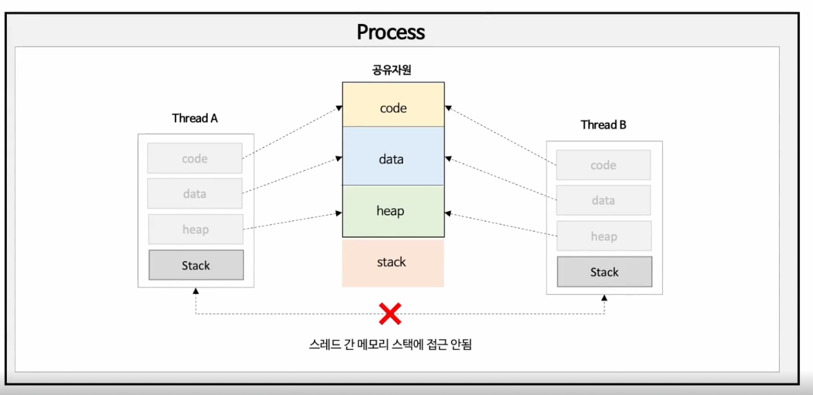
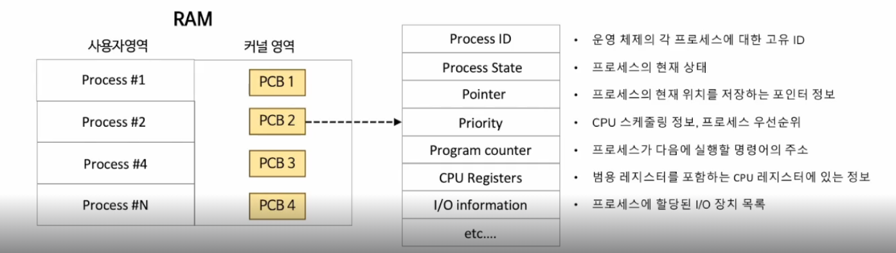
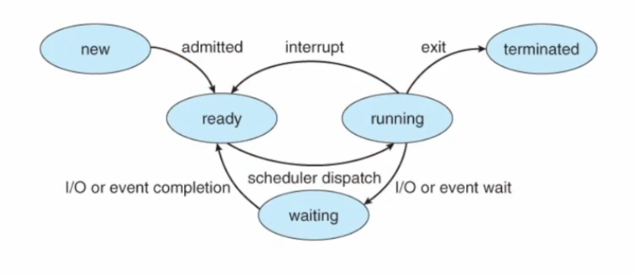
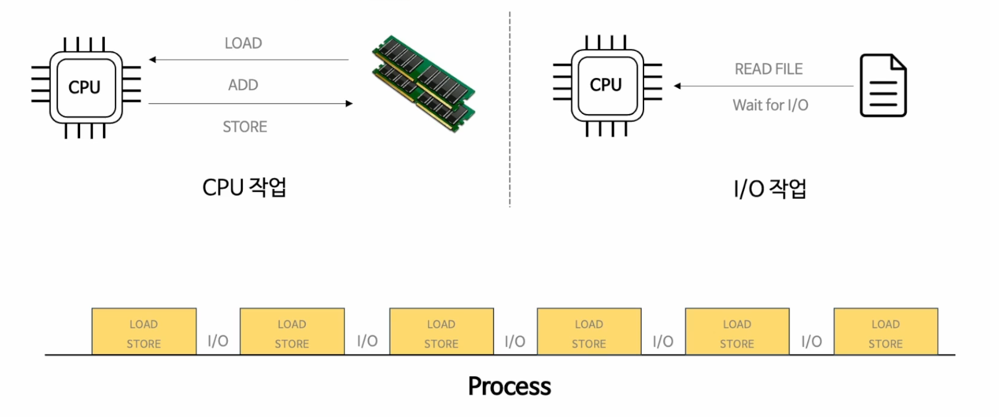
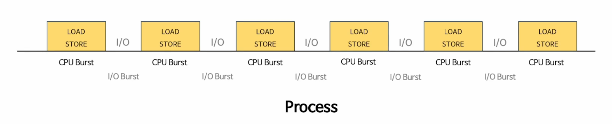
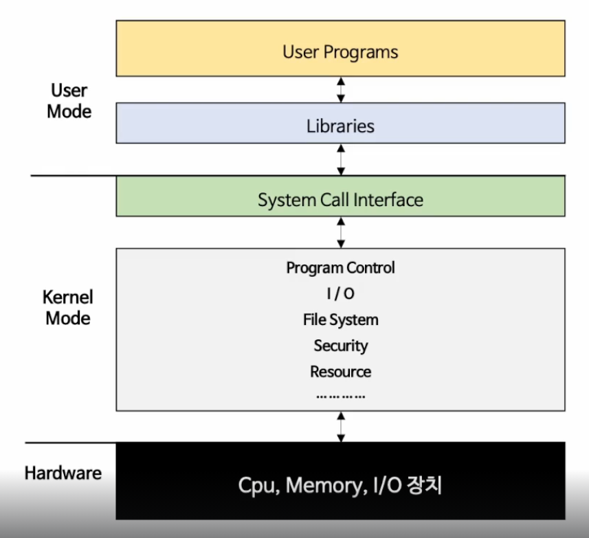
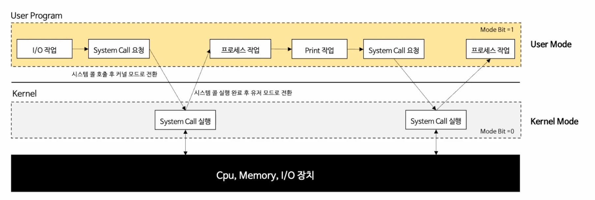

> 정수원 강사님 인프런 자바 동시성 프로그래밍 part.1

#os #concurrency #JAVA 

# Process & Thread

## Process

프로세스는 파일시스템에 저장된 프로그램을 실행을 위해 메모리에 올리고 CPU 를 할당받아 명령을 수행할 수 있는 상태이며, 운영체제로부터 자원을 할당 받은 최소 작업단위를 뜻한다.

`프로그램` : 운영체제에 의해 파일 시스템에 설치 되어 있는 파일
`프로세스` : 프로그램을 실제 실행하는 행위를 의미한다.
- 프로그램의 데이터가 메모리에 올라가 있는 상태
- CPU 를 할당 받아 명령을 수행하는 상태
- 운영체제로 부터 자원을 할당 바는 최소 작업단위

프로세스는 운영체제로부터 메모리를 할당 받게 되면 커널의 동작을 위한 영역을 제외한 4가지 영역으로 나뉜다.

### Stack

함수의 안에서 선언된 지역변수, 매개변수, 리턴 값 등을 저장하며, 함수의 호출과 함께 할당 되었다가 함수의 호출이 종료되면 소멸한다. 

```c
// a 는 매개변수로 Stack 에 저장된다.
int foo(char a) {
	// b 는 지역변수로 Stack 에 저장된다.
	int b = 10;

	// a + b 의 결과 값은 리턴 값으로 Stack 에 저장된다.
	return a + b;
}
```

위 코드에서는 a, b, a+b 의 결과 값이 Stack 영역에 저장되는 대상이된다. 

Stack 함수의 호출이 되면 높은 주소에서 낮은 주소로 할당하게 되며 함수가 종료되면 낮은 주소 부터 차례로 해제된다.
### Heap

사용자에의해 메모리가 동적으로 할당되고 해제할 수 있는 영역으로 메모리의 주소가 낮은 주소에서 높은 주소의 방향으로 할당되게 된다. 보통 객체나 배열, 문자열 등이 저장된다.

> `c` 언어에서 `malloc`, `calloc`, `realloc` 등을 이용해 메모리를 할당하고, `free` 를 이용해 메모리를 해제한다.

```c

int foo(int char_len) {
	// malloc 를 이용해서 char 크기의 영역을 char_len 만큼 할당
	char* char_pointer = (char*)malloc(sizeof(char) * char_len);

	// free 를 이용해서 할당된 메모리를 해제한다.
	free(char_pointer);
}
```

여기서 주의해야할 사항이 있다. 메모리를 할당하게 되면 반드시 free 를 이용하여 메모리를 해제해 주어야 한다. 그렇지 않으면 동적 할당 영역이 가득 차게 되어 `memory leak` 이슈가 발생하게 될 것이다. 

> Stack과 Heap 은 동적할당이므로 프로세스가 실행됨에 따라 사용되는 메모리가 증감할 수 있다. 
### Data

코드가 실행 되면서 사용하는 전역변수, `static` 변수 등이 저장되며 프로그램이 시작과 함께 할당되고, 프로그램이 종료되면 소멸하게 된다.

```c
#include <stdio.h>

// 전역 변수이다.
int global_value = 10;

int main() {
	// 스테틱 변수이다.
	static int static_value = 20;
	return 0;
}

```


위 같은 전역변수와 스테틱 변수를 자주 사용하면 프로그램이 동작할 때 기본적으로 많은 메모리를 할당하게 되므로 지양해야 하는 방법이다. 

하지만 특정한 경우 (예: enum 같이 정적으로 정의된 데이터) 를 필요로 할 때에는 나쁘지 않은 방법이기 때문에 필요한 곳에서 적절히 사용하면 아주  유용하다.

Code 영역 다음으로 낮은 주소에 위치하며 정적으로 저장되는 영역이다.

### Code

사용자가 작성한 프로그램 함수들의 코드가 자리하는 영역으로 CPU 는 코드 영역에 저장된 명령어를 하나씩 가져가서 처리하게 된다.

가장 낮은 주소에 위치하고 있으며, Data 영역과 같이 정적으로 할당되는 영역이다.

## 그래서 

운영체제는 프로세스마다 독립된 `Code` `Data` `Heap` `Stack` 영역을 할당하여 프로세스간에 영향을 받지 않고 독립적인 작업을 수행할 수 있도록 한다. 기본적으로는 다른 프로세스의 변수나 자료에 접근할 수 없고 IPC 나 공유메모리 등을 이용해 프로세스간 통신이 가능하다.

> `IPC (Inter Process Communication)` 프로세스 사이에서 서로 데이터를 주고 받는 행위 또는 그에 대한 방법이나 경로
> `Shared Memory(공유메모리)` 여러 환경에서 동시에 접근할 수 있는 메모리, 여러 프로세스에서 동시에 접근하기 때문에 사용시 주의해서 사용해야 한다.

또한 프로세스는 자식프로세스를 생성하여 동작할 수 있으며, 자식 프로세스는 부모 프로세스와 동일한 메모리영역을 새로 할당하게 된다.
## Thread

프로세스가 운영체제로부터 할당 받은 자원을 이용하는 실행 단위 또는 흐름의 단위로서 하나의 프로세스는 **반드시 하나 이상의 스레드를 갖는다.**

이 부분은 프로세스에서 스레드가 스택 영역을 할당 받는 부분의 이해를 돕기위해 정수원님의 `인프런 자바 동시성 병렬 프로그래밍 리엑티브 part 1` 에서 캡쳐했다



실제로 코드를 실행 시키는 주체로 CPU 는 프로스세를 알지 못하고 스레드를 알고 있다.

스레드는 프로세스 내에서 각 필요한 `Stack` 메모리 영역만 할당 받으며, `Code` `Data` `Heap` 메모리 영역은 각 스레드가 공유하여 처리하게 된다. 따라서 스레드간 스택 영역에 접근할 수 없으므로 독립된 실행을 할 수 있게 된다. 이 것은 프로세스와 스레드의 가장 큰 자이점이라고 할 수 있다.

스레드도 서로 공유하지 않는 영역이 있는데 Stack 영역이다. 이러한 공유영역과 프로세스와의 차이점에 대해서는 알고 있어야 개발할때 편할것 같다.

### Thread & CPU 

운영체제 스케줄러에 의해 관리되는 CPU 의 최소 실행 단위로 스케줄러 알고리즘에 따라 프로세스에 속한 한개의 스레드가 선점되어 CPU 에 할당된다. 이 때 CPU 의 실행 흐릅(문맥, Context) 이 전환되는 문맥전환(Context Switching) 이 발생한다.

> 스케줄러의 알고리즘은 따로 조사해봐도 좋을 것 같다.


### Process vs Thread

#### Process
- 자식 프로세스를 생성할 수 있으며, 하나의 자식 프로세스에 문제가 발생하더라도 다른 프로세스에 영향을 주지 않아 프로그램 전체의 안전성을 확보할 수 있다.
- 프로세스 컨텍스트 스위칭이 필요한 경우 레지스터, 캐시메모리 초기화 등 비싼 시간적 비용을 지불해야 한다.
- 프로세스간 통신을 위한 기법이 어렵고 복잡하여 통신으로 인한 오버헤드가 크다.
- 프로세스 생성시 독립적인 자원 할당으로 인한 리소스 비용이 크다.

#### Thread
- 여러 스레드 중 하나가 문제가 발생하면 전체 프로세스에 영향을 미친다.
	- 하나의 스레드에서 오류가 발생하면 프로세스가 종료될 수 있다.
- 프로세스의 메모리를 공유하므로 컨텍스트 스위칭 시간이 적고 리소스를 효율적으로 사용할 수 있다.
- 스레드간 통신비용이 적어 통신으로 인한 오버헤드가 적다.
- 스레드간 공유메모리(code, data, heap) 접근시 동기화 문제가 발생할 수 있다.

# Parallel(병렬성) & Concurrent(동시성)

## 동시성 과 병렬성

동시성은 특정한 순서 없이 겹치는 기간에 시작, 실행, 완료 되는 여러 작업을 의미하며, 병렬성은 동시에 실행되는 동일한 작업이다. 

이렇게 보면 동시성과 병렬성은 동일한 것 같아보이지만 서로 다름을 알아야한다.

### 동시성

동시성은 CPU가 한번에 얼마나 많은 일을 처리하는가에 중점을 둔다. 즉 많은 작업을 빠른 시간으로 교체하면서 전체 작업이 처리되며, 작업을 빠르게 처리하기위한 목적이 아닌 CPU가 얼마나 효율적으로 동작하는지에 대해 중점을 둔다.
-   Thread 작업을 처리하다 IO Blocking 이 되면 CPU 는 다른 스레드로 전환하서 작업을 진행한다.

이러한 동시성은 작업에 대한 처리 방식을 어떻게 진행할 것인가에 대해 설계적 관점에서 이해해야 한다. 작업의 수가 CPU 코어수 보다 많은 경우 해당되며, 동시성이 없으면 작업을 순차적으로 진행해야하기 때문에 병목이 발생 할 수 있다

요약 하자면 서로 다른 작업을 동시에 처리한다는거다.

예) Task1 (Thread 1), Task2 (Thread 2) 는 서로 다른 작업이다. 

1. CPU 는 Task1 의 작업을 진행한다.
2. Task1 에서 Blocking (대표적으로 IO)
3. Task2 로 작업 전환
4. Task2 에서 Blocking 
5. 각 작업이 모두 종료될 때까지 1~ 4번 반복

### 병렬성

병렬성은 CPU가 동시에 많은 일을 수행하는것에 중점을 둔다. CPU 를 여러개(여러 코어)를 두어 작업을 물리적으로 동시에 실행하게 된다. 

동시성의 하위 개념으로 작업을 여러 Thread 에 분리하고, 운영체제는 그 Thread 를 여러 CPU 에 적절히 분배하여 동시에 실행하도록 만드는 것이다. 이러한 병렬성은 하드웨어 계청에서 작업을 수행하는 방식에 관한 것으로 작업의 수가 CPU 코어 수 보다 같거나 적을 경우 효율이 좋아진다.

## 동시성과 병렬성의 조합 - ThreadPoolExecutor

병렬성으로 처리 성능을 극대화 하고 동시성으로 CPU 자원을 효율적으로 운영

- ThreadPool 클래스를 이용해서 Thread 를 생성, 실행, 회수를 관리 

## Parallelism : Divide and Conquer - ForkJoinPool

하나의 Task 를 SubTask 로 분할하여 병렬처리함으로서 전체 작업 성능을 높인다. 자바에서는 ForkJoinPool 을 체택해서 처리한다고 한다.

- 1번 Thread, 2번 Thread 의 작업 결과를 합쳐서 최종 결과를 도출

> https://junghyungil.tistory.com/103


### Code 로 보는 동시성과 병렬성

```java
// 병렬처리 예제  
public class ParallelismExample {  
  
    public static void main(String[] args) {  
        // CPU 코어 수 확인  
        int cpuCores = Runtime.getRuntime().availableProcessors();  
  
        // CPU Core 수 만큼 Integer Data 생성  
        List<Integer> integers = IntStream.range(0, cpuCores).collect(ArrayList::new, List::add, List::addAll);  
  
        // 병렬 처리를 위한 ParallelismFunction 생성  
        final ParallelismFunction parallelismFunction = new ParallelismFunction();  
  
        long startTime = System.currentTimeMillis();  
        long sum = integers.parallelStream().mapToLong(parallelismFunction::apply).sum();  
  
        long endTime = System.currentTimeMillis();  
        System.out.println("[처리 결과]");  
        System.out.println("Cpu Cores: " + cpuCores);  
        System.out.println("Sum: " + sum + ", Time: " + (endTime - startTime) + "ms");  
  
    }  
  
    private static class ParallelismFunction implements Function<Integer, Long> {  
  
        @Override  
        public Long apply(Integer integer) {  
            try {  
                Thread.sleep(1000);  
            } catch (InterruptedException e) {  
                throw new RuntimeException(e);  
            }  
            return integer.longValue() * integer.longValue();  
        }  
    }  
}
```


위 코드에서 나는 8 core 를 할당 받는다. 이 때 cpuCores 의 값을 +1 해 병렬 처리의 개수를 늘리면 처리 결과가 달라지는 것을 확인할 수 있다. 

기존에는 약 1초의 시간이 걸렸다면  단 1 개의 데이터만 늘렸을 뿐인데도 1초가 추가된 2초가 걸리는것을 확인할 수 있다. 

이렇듯 병렬처리는 CPU 의 (정확히는 Thread 의) 처리 개수를 초과하는 경우에는 코어의 수 만큼 작업이 완료 되고, 그 다음 작업이 실행되므로 병렬성은 만족하지만 동시성은 만족하지 못해 1초가 더 걸린것이다.


# Context Switch 

하나의 CPU 는 동일한 시간에 하나의 작업만 수행 가능하기 때문에 여러 프로세스를 동시에 수행할 수 없다.
컨텍스트 스위치는 하나의 CPU 에서 여러 프로세스를 처리하기 위해서는 프로세스에서 프로세스로 전환이 필요로 하는데 이것을 컨텍스트 스위치라고 한다.

### Context

*프로세스 간 전환*을 위해서는 이전에 어디까지 명령을 수행했고 `CPU Register` 에는 어떤 값이 저장되어 있는지에 대한 정보가 필요하다.
Context 는 프로세스를 실행하기 위한 프로세서의 정보를 의미하며 이 정보가 운영체제가 관리하는 PCB 라고하는 자료구조 공간에 저장된다.

### PCB (Process Control Block)

운영체제가 시스템 내의 프로세스들을 관리하기 위해 프로세스마다 유지하는 정보를 담는 커널 내의 자료구조이다. 컨텍스트 스위칭은 CPU가 프로세스간 PCB 정보를 교체하고 캐시를 비우는 일련의 과정이라고 볼 수 있다.



### 프로세스 상태

프로세스는 생성, 준비, 실행, 대기, 종료 상태를 갖는다.

- 생성 : 프로세스를 새성하고 단계별로 커널 영역에 PCB 가 만들어진 상태
- 준비 : 프로세스가 CPU 를 할당받기 위해 기다리고 있는 상태
- 실행 : 프로세스가 CPU 를 할당받아 명령어를 실행중인 단계
- 대기 : 프로세스가 I/O 작업 완료 혹은 사건 발생을 기다리는 상태
- 종료 : 프로세스가 종료된 상태



### Context Switching 이 발생하는 조건

실행중인 프로세스에서 I/O 호출이 일어나 해당 I/O 작업이 끝날때 까지 프로세스 상태가 running 에서 waiting 상태로 전이되는 경우
RoundRobin 스케쥴링 등 운영체제의 CPU 스케줄러 알고리즘에 의해 현지 실행중인 프로세스가 사용할 수 있는 시간 자원을 모두 사용했을 때 해당 프로세스를 중지하고 다른 프로세스를 실행하는 경우


### TCB (Thread Control Block)

스레드 상태정보를 저장하는 자료구조이며, PC 와 Register Set(CPU 정보), 그리고 PCB를 가리키는 포인터를 갖는다. 스레드가 하나 생성될 때마다 PCB 내에서 TCB가 생성되며 컨텍스트 스위칭이 일어나면 기존의 스레드 TCP 를 저장하고 새로운 TCB 를 가져와 실행한다.

### 프로세스 vs 스레드

프로세스는 컨텍스트 스위칭시 메모리 주소 관련 여러가지 처리를 하기 때문에 오버헤드가 크다.
- CPU 캐시 초기화 
- TLB 초기화
- MMU 주소 체계 수정 
- 등등
스레드는 프로세스 내 메모리를 공유하기 때문에 메모리 주소 관련 추가작업이 없어 프로세스에 비해 오버헤드가 적어 컨텍스트 스위칭이 빠르다.
스레드는 생성하는 비용이 커서 많은 수의 스레드 생성은 메모리 부족 현상이 발생하거나 빈번한 컨텍스트 스위칭으로 인해 어플리케이션의 성능이 저하될 수 있다.

### Code 로 보는 Context Switching 

```java
  
public class ContextSwitching {  
    public static void main(String[] args) {  
  
        // 5개의 스레드 생성  
        Thread thread1 = new Thread(new SleepFunction(1)::run);  
        Thread thread2 = new Thread(new SleepFunction(2)::run);  
        Thread thread3 = new Thread(new SleepFunction(3)::run);  
        Thread thread4 = new Thread(new SleepFunction(4)::run);  
        Thread thread5 = new Thread(new SleepFunction(5)::run);  
  
        thread1.start();  
        thread2.start();  
        thread3.start();  
        thread4.start();  
        thread5.start();  
    }  
}  
  
class SleepFunction implements Runnable {  
    private int threadNum;  
  
    public SleepFunction(int threadNum) {  
        this.threadNum = threadNum;  
    }  
  
    @Override  
    public void run() {  
        for (int i = 0; i < 5; i++) {  
            System.out.println("Thread " + threadNum + " : " + i);  
            try {  
                Thread.sleep(1);  
            } catch (InterruptedException e) {  
                throw new RuntimeException(e);  
            }  
        }  
    }
}
```

결과는 아래와 같다. 

```text
5:47:42 PM: Executing ':ContextSwitching.main()'...

> Task :compileJava
> Task :processResources NO-SOURCE
> Task :classes

> Task :ContextSwitching.main()
Thread 2 : 0
Thread 3 : 0
Thread 1 : 0
Thread 5 : 0
Thread 4 : 0
Thread 2 : 1
Thread 5 : 1
Thread 4 : 1
Thread 3 : 1
Thread 1 : 1
Thread 4 : 2
Thread 5 : 2
Thread 3 : 2
Thread 2 : 2
Thread 1 : 2
Thread 4 : 3
Thread 5 : 3
Thread 3 : 3
Thread 2 : 3
Thread 1 : 3
Thread 4 : 4
Thread 5 : 4
Thread 1 : 4
Thread 3 : 4
Thread 2 : 4

Deprecated Gradle features were used in this build, making it incompatible with Gradle 9.0.

You can use '--warning-mode all' to show the individual deprecation warnings and determine if they come from your own scripts or plugins.

For more on this, please refer to https://docs.gradle.org/8.4/userguide/command_line_interface.html#sec:command_line_warnings in the Gradle documentation.

BUILD SUCCESSFUL in 429ms
2 actionable tasks: 2 executed
5:47:42 PM: Execution finished ':ContextSwitching.main()'.

```

주의 : 이 코드는 컨텍스트 스위치를 대면하는 코드가 아니라 예시이다. 

스레드의 번호를 잘 보자 이게 실제 컨텍스트 스위치가 동작함에 따라 발생하는 처리 결과이다.

# CPU & I/O Bound 

프로세스는 CPU 작업과 IO 작업의 연속된 흐름으로 진행이 된다.



CPU 는 메모리로부터 데이터를 불러오고 저장하는 CPU 작업이 IO 를 만나게 되면 잠시 대기하고 IO 작업이 완료되면 다시 CPU 작업을 수행하게 된다. 이는 특정 Task 가 완료될 때까지 이를 반복하게 된다.

## Burst

한 작업을 짧은 시간동안 집중적으로 연속해서 처리하거나 실행하는 것으로 CPU Burst 와 I/O Burst 가 있다.


### CPU Burst 

CPU 를 연속적으로 사용하면서 명령어를 실행하는 구근으로 프로세스가 CPU 명령어를 실행하는데 소비하는 시간을 의미한다. 이때 프로세스의 실행 상태를 처리한다.

### I/O Burst

연속적으로 I/O 를 실행하는 구간으로 I/O 작업이 수행되는 동안 대기하는 구간을 의미하며, 프로세스가 I/O 요청이 완료되는데 걸리는 시간을 의미한다. 이때 프로세스의 대기 상태를 처리한다.

## Bounded Process

프로세스마다 CPU 버스트와 I/O 버스트가 차지하는 비율이 균일하지 않으며, 이 비율을 기준으로 해서 CPU 바운드 프로세스와 I/O 바운드 프로세스로 나눌눈다.

### CPU Bounded Process

CPU Burst 작업이 많은 프로세스로서 I/O Burst 가 거의 없는 경우이다. 대표적으로 머신러닝, 블록체인, 동영상 편집 프로그램 등의 CPU 연산위주의 작업을 의미한다.

멀티 코어의 병렬성을 최대한 활용해서 처리성능을 극대화 하도록 스레드를 운용한다. 일반적으로 CPU 코어수와 스레드 수의 비율을 비슷하게 설정한다.

```java

public class CPUBound {  
    public static void main(String[] args) {  
        // CPU 코어 수 확인  
        int numThreads = Runtime.getRuntime().availableProcessors();  
        // Thread 생성기  
        ExecutorService executorService = Executors.newFixedThreadPool(numThreads);  
  
        long start = System.currentTimeMillis();  
        List<Future<?>> future = new ArrayList<>();  
        for (int i = 0; i < numThreads; i++) {  
            Future<?> submit = executorService.submit(new CPURunnable());  
            future.add(submit);  
        }  
  
        for (Future<?> future1 : future) {  
            try {  
                future1.get();  
            } catch (InterruptedException e) {  
                throw new RuntimeException(e);  
            } catch (ExecutionException e) {  
                throw new RuntimeException(e);  
            }  
        }  
  
        long end = System.currentTimeMillis();  
        System.out.println("Time: " + (end - start) + "ms");  
        executorService.shutdown();  
    }  
}  
  
class CPURunnable implements Runnable {  
  
    @Override  
    public void run()  {  
        long result = 0;  
        // CPU 연산이 집중되고 오래 걸리는 작업  
        for (int i = 0; i < 100000000L; i++) {  
            result += i;  
        }  
  
        try {  
            // 잠시 대기  
            Thread.sleep(1);  
        } catch (InterruptedException e) {  
            throw new RuntimeException(e);  
        }  
  
        System.out.println("Thread: " + Thread.currentThread().getName() + ", result: " + result);  
    }  
}
```

### I/O Bounded Process

I/O Burst 가 빈번히 발생하는 프로세스로서 CPU Burst 가 매우 짧다. 파일, 키보드, DB, 네트워크 등 외부 연결이나 입출력 장치와의 통신 작업이 많은 경우에 해당한다.

CPU 코어가 많을 경우 멀티 스레드의 동시성을 퇴대한 활용하여 CPU 가 Idle 상태가 되지 않도록 하고 최적화 된 스레드 수를 운용해서 CPU 의 효율적인 사용을 극대화 한다.

- Thread 가 대기하게 되면 CPU 가 작업을 처리하지 않고 대기하는 시간이 길어지기 때문에 처리하는 Thread 의 개수를 늘려서 CPU 가 작업을 대기하는 시간을 최소화 하도록 해야한다. 

> 이 부분이 이번 과업범이에서 필요로하는 부분일 것 같다. 실체 내부 프로세스에서 하나의 작업을 진행하기 위해 네트워크 I/O가 3~5번, DB I/O 가 2 번 가량 발생할 예정이다.
> 
> 2 Core 4GB 가 최소 사양이다. 사용자에게 ThreadPool 을 

https://velog.io/@xogml951/Scalability-Test-Thread-Pool-DBCP-%EC%A0%81%EC%A0%95-%EC%84%A4%EC%A0%95%EA%B0%92-%EC%B0%BE%EA%B8%B0

위 블로그를 참고해서 Thread 를 몇 개 운용할지에 대해 정리해봐야겠다.

```java
public class IOBound {  
    public static void main(String[] args) {  
        int numThreads = Runtime.getRuntime().availableProcessors() / 2;  
        ExecutorService executorService = Executors.newFixedThreadPool(numThreads);  
  
        long start = System.currentTimeMillis();  
        for (int i = 0; i < numThreads; i++) {  
            executorService.submit(new FileIOCallable(i)::run);  
        }  
        long end = System.currentTimeMillis();  
  
        System.out.println("Time: " + (end - start) + "ms");  
        executorService.shutdown();  
    }  
}  
  
class FileIOCallable implements Runnable {  
    private int threadNum;  
  
    public FileIOCallable(int threadNum) {  
        this.threadNum = threadNum;  
    }  
  
    @Override  
    public void run() {  
        // IO 집중 작업  
        try {  
            for (int i = 0; i < 5; i++) {  
                Files.readAllLines(Path.of("~/workspace/study/book/java-concurrency-programming/src/main/java/section01/example03/ioboundedprocess"));  
                System.out.println("Thread: " + Thread.currentThread().getName() + ", thread num: " + this.threadNum + ", i: " + i);  
            }  
  
            // 아주 빠른 CPU 연산  
            int result = 0;  
            for (int i = 0; i < 10; i++) {  
                result += i;  
            }  
        } catch (IOException e) {  
            e.printStackTrace();  
        }  
  
    }  
}
```

# 사용자 모드 & 커널 모드

운영체제는 사용자가 컴퓨터를 편리하게 사용할 수 있는 환경을 제공하고 자원을 효율적으로 관리하기 위한 소프트웨어이며 이 중 가장 핵심 기능을 담당하는 부분이 커널이라고 한다.

운영체제는 응용프로그램이 하드웨어가 직접적으로 접근하는것을 방지하여 하드웨어를 보호하는 역할을 한다. 이는 Application 은 운영체제의 도움을 받아 하드웨어를 동작할 수 있게 되는데 이를 위한 특별한 권한(하드웨어에 접근할 수 있는 모드)이 있다.

## CPU 권한 모드

CPU 는 명령어를 실행할 때 크게 두 가지 권한 모드로 구분해서 실행한다.

- 사용자모드
- 커널모드

### 사용자 모드 (Mode Bit = 1)

사용자 응용프로그램이 실행되는 모드로서 메모리의 유저영역만 접근 가능하며, 디스크, Printer 메모리 및 여러 I/O 장치와 같은 리소스에 접근이 불가능하다.

대부분의 응용프로그램은 입출력 장치나 파일로의 접근이 필요하기 때문에 이 때는 유저모드에서 커널모드로 전환이 되어야 한다.

### 커널 모드 (Mode Bit = 0)

커널 영역의 코드가 실행되는 모드로서 메모리의 유저영역, 커널영역 모드 접근가능하며, 하드웨어 자원에 직접 접근이 가능하다.

커널 영역에서는 운영체제의 코드가 실행된다.

## 시스템 호출 (System Call)

응용프로그램이 운영체제의 커널이 제공하는 서비스를 이용할 수 있도록 사용자모드에서 커널모드로 접근하기 위한 인터페이스이며, 응용프로그램이 파일 입출력 또는, 화면 출력 등의 기능은 커널모드에서 CPU가 실행하기 때문에 반드시 시스템 호출을 이용해서 커널모드로 전환해야 한다.



### 시스템 호출 동작 과정

사용자 응용프로그램이 작업과정에서 빈번하게 시스템 호풀을 요청하고 이로인해 사용자 모드와 커널 모드를 상호 전환하며 실행하게 된다. 

I/O 처리를 위해 사용자 모드와 커널 모드를 번갈아 오가는 것은 컨텍스트 스위칭과 관련이 있으며 멀티 스레드 환경에서 참고해야 할 중요한 배경적 지식이다.!!



위 그림처럼 시스템 콜 요청이 들어오면 커널에서 시스템 호출을 실행하고 작업이 완료 되면 사용자 모드로 전환하여 사용자 프로그램의 작업을 처리하게 된다.

# 사용자 수준 스레드 & 커널 수준 스레드

스레드는 크게 두 가지 수준의 스레드가 있다.

- 사용자 수준 스레드 : 사용자 프로그램에서 관리하는 스레드
- 커널 수준 스레드 : OS 에서 관리하는 스레드

## 사용자 수준 스레드 (User Level Thread : ULT)

사용자 영역에서 Thread Library (Pthreads, Windows Threads, Java Threads(JVM)) 에 의해 스레드의 생명주기, 스레드간 메시지 전달, 스레드의 스케쥴링 보관등을 관리하게 된다.

또한, 커널은 사용자 수준의 스레드에 대해 알지 못하며 단일 스레드 프로세스인 것 처럼 관리하게 된다.

## 커널 수준 스레드 (Kernel Level Thread : KLT)

커널이 스레드와 관련된 모든 작업을 관리(PCB와 TCB 관리/유지)한다. 

- CPU 는 커널에 의해 생성된 스레드만 실행을 담당하게 된다.

커널은 커널 스레드의 모든 정보를 알고 있으며 커널 스레드는 OS 의 스케쥴러에 의해 스케줄링 된다.

## 멀티 스레딩 모델

CPU 는 OS 스케쥴러가 예약하는 커널 스레드만 할당받아 실행시키 때문에 ULT 는 KLT 와 맵핑을 필요로 한다. 이 때 ULT 는 3가지 모델을 이용해서 KLT와 맵핑할 수 있다.

- N:1 스레드 맵핑 (다대일 스레드 맵핑)
- 1:1 스레드 맵핑 (일대일 스레드 맵핑)
- N:M 스레드 맵핑 (다대다 스레드 맵핑)
### N:1 스레드 맵핑 (many to one thread mapping)

다수의 사용자 수준 스레드가 커널 수준 스레드 한개에 매핑하는 유형으로 사용주 수준의 스레드 모델이라 볼 수 있다. 

커널의 개입이 없기 때문에 며사용자 스레드끼리 스위칭이 발생하여 오버헤드가 적다 또한 스케쥴링이나 동기화를 하려고 커널을 호출하지 않으므로 커널영역으로 전환하는 오버헤드를 줄일 수 있다.

개별 스레드 단위가 아닌 단일 스레드의 프로세스 단위로서 프로세서를 할당하기 때문에 멀티코어를 활용한 병렬처리를 할 수 없다.

- 한 스레드(사용자 스레드)에서 I/O Blocking 되면 모든 스레드들이 Block이 발생하게 되는데 이는 프로세스 자체를 블록하기 떄문이다.

이 모델은 TCB 는 사용자 영역의 Thread Libraries가 괸리하며, PCB 는 커널 영역에서 관리하게 된다.

### 1:1 스레드 맵핑 (one to one thread mapping)

사용자 수준 스레드와 커널 수준 스레드가 일대일로 맵핑되는 구조로 커널 수준의 스레드 모델이라고 볼 수 있다.

커널 전체의 스레드 정보를 유지해야하기 때문에 컨텍스트 스위칭시 사용자 모드에서 커널모드로 전환해 스케줄링을 진행하기 때문에 오버헤드가 발생한다.

또한, 커널 모드의 스레드는 비용이 매우 크며 한정된 자원(CPU 의 코어 수)을 사용하기 때문에 스레드를 무한정 생성할 수 없으며, 대안으로 ThreadPool 을 활용하기도 한다.

스레드 단위로 CPU 를 할당하기 때문에 멀티코어를 활용한 병렬처리가 가능하다.

스레드중 한 개가 대기상태가 되더라도 다른 스레드를 실행할 수 있으므로 멅티스레드의 동시성을 활용할 수 있다.

자바의 Native Thread (현재의 자바)가 이 모델을 사용하기 있다는것을 알아두면 좋을 것 같다.

이 모델은 컨텍스트 스위칭시 커널영역에서 사용자 모드에서 생성된 스레드 정보를 관리해야하기 때문에 TCB 와 PCB가 모두 커널 영역에 존재한다.

### N:M 스레드 맵핑 (many to many thread mapping)

여러개의 사용자 수준 스레드를 같은 수 또는 그보다 작은 수의 커널 수준 스레드로 맵핑을 한다.
각 커널 수준의 스레드가 사용자수준의 스레드 한 개 이상과 맵핑된다.

이 모델은 N:1, 1:1 모델의 단점을 어느정도 해결이 가능하며, 개발자는 필요한 만큼 많은 사용자 수준의 스레드를 생성할 수 있고 커널 수준의 스레드가 멀티프로세서에서 병렬로 수행될 수 있다.

사용자 수준 스레드가 I/O 시스템 콜 발생을 했을 때 커널이 다른 스레드의 수행을 스케줄 할 수 있다 

이 때문에 커널 영역에서는 사용자 수준의 스레드와 커널 수준의 스레드를 모두 알아야 하므로 TCB와 PCB 를 커널 영역에서 관리하게 된다.

이것은 Java 에서 Virtual Thread 와 비슷한 구조이다.


