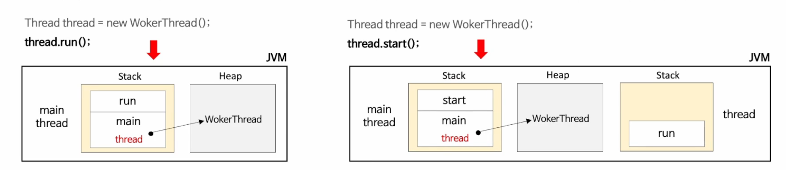

스레드의 생성 및 실행 구조에 대해서 정리

# 스레드 생성 - Thread & Runnable

자바의 스레드는 JVM 에서 사용자 스레드를 생성할 때 시스템 호출을 통해서 커널에서 생성된 커널 스레드와 1:1 맵핑되어 최종적으로 커널에서 관리된다. 따라서 JVM 에서는 스레드를 생성할 때마다 커널에서 자바 스레드와 대응하는 커늘 스레드를 생성한다.

자바에서는 Platform Thread 으로 정의 되어 있다. 즉 OS 플랫폼에 따라 JVM 이 사용자 스레드를 맵핑하게 된다.

> **Platform Thread** : 운영체제에서 제공하는 기본적인 스레드 구현체로 애플리케이션 개발자가 직접 제어가능한 최소 실행 단위이다. (이 부분은 다시 한 번 정리해봐야겠다)


```java

public class Object {
	public final void wait(); // 스레드를 대기상태로 전환
	@HotSpotIntrinsicCandidate
	public final native void notify(); // 대기 상태의 스레드 하나를 깨운다
	@HotSpotIntrinsicCandidate
	public final native void notifyAll(); // 대기 상태의 스레드 모두를 깨운다
}

@FunctionalInterface  
public interface Runnable {
    public abstract void run(); // 스레드의 실행 메서드의 추상화
}

public class Thread implements Runnable {
	void start(); // 스레드 시작
	void run(); // 스레드 실행 영역
	static void sleep(long ms) throws InterruptedException; // 지정된 시간동안 스레드 대기
	void join(); // 해당 스레드가 종료될 때까지 현재 스레드 대기
	void interrupt(); // 스레드에 실행 중단 신호 전달
	static boolean interrupted(); // 인터럽트 상태 확인
	boolean isInterrupted(); // 인터럽트 상태 확인
	void setName(String name); // 스레드 이름 설정
	void setPriority(int priority); // 스레드 우선순위 설정
	boolean isAlive() // 스레드 활성화 여부 반환
	Thread currentThread(); // 현재 수행중인 스레드 객체 반환
	int activeCount(); // 현재 활성화 되어 있는 스레드 수 반환
	void setDaemon(boolean on); // 스레드를 데몬 스레드로 설정
	State getState(); // 스레드의 현재 상태 반환
}

```

위 코드에서 나와있듯 JAVA 에서 `Thread` 클래스는 `Runnable` 인터페이스의 구현체로서 동작한다. 이 때 `Runnable#run` 은 스레드의 실행 메서드가 되고, 예외를 외부로 던질수 없다.

## 스레드를 생성하는 방법

### Thread Class 의 상속

개발자는 Thread 를 상속받은 클래스를 생성하여 직접 Runnable 추상화 메서드인 run() 메서드를 직접 구현한다.

```java
public class MyThread extends Thread {

	public void static main(String[] agrs) {
		Thread thread = new MyThread();
		thread.start();
	}

	@Override
	public void run() {
		// TODO write your tasks 
	}
}
```

### Runnable Interface 구현

개발자는 Runnable 의 구현체를 만들어 Thread 에 전달하여 동작하도록 구현한다.

```java
public class MyTask implements Runnable {
	public void static main(String[] args) {
		Runnable task = new MyTask();
		Thread thread = new Thread(task);
		thread.start();
	}
	@Override 
	public void run() {
		// TODO write your tasks 
	}
}
```

위 두 가지 방법은 결국 Runnable 인터페이스의 run 메서드를 직접 구현한다는 것이다.

이 두 가지 방식중 선호되는 방식(또는 권장되는)은 Runnable 의 구현이다. Thread 객체를 상속받아 사용하는 방법은 기본적인 방식이긴 하나 컴파일 단계에서 코드가 결정되기 때문에 작업에 대해 동적인 변경이 불가능하다는 단점이 있다. 하지만 Runnable 는 여러 구현체를 만들어 실행단계에서 동적인 할당이 가능하여 좀더 유연하고 확장이 가능한 구조가 된다. 
또한 작업의 유연함이 필요 없는경우 Runnable 을 람다식으로 구현함으로써 코드가 간결해질 수 있다는 장점이 있다.
# 스레드 실행 및 종료 - start() & run()

자바 스레드는 OS 스케줄러에 의해 실행 순서가 결정되며 스레드 실행 시점을 JVM 에서 제어할 수 없다.

새로운 스레드는 현재 스레드와 독립적으로 실행되고 최대 한번 시작되며 종료후에는 다시 시작할 수 없다.

### start() - 스레드의 실행

스래드를 실행 시키는 메서드로 시스템 호출을 통해서 커널에 커널 스레드 생성을 요청한다.

스레드가 실행되는 처리 절차는 다음과 같다.

1. 프로세스가 실행되면 메인 스레드가 새로운 스레드를 생성한다
	- `Thread thread = new Thread()`
2. 메인 스레드가 start() 메서드를 호출해서 실행을 시작한다.
	- `thread.start()`
3. 내부적으로 네이티브 메서드인 start0() 메서드를 호출해서 커널에게 커널 스레드를 생성하도록 시스템 호출을 요청한다.
	- `Thread#start0() -> private native void start0();`
	- Java 11 버전 기준 `Thread.class:812`
	- `native` 키워드가 붙은 메서드는 일반적으로 자바에서 실행되는것이 아닌 밑단의 커널 또는 운영체제의 도움을 받기 위해 시스템 콜을 요청하기 위한 메서드이다.

```java
/** 
  * Thread#start0()
  */

public class Thread implements Runnable {
	// ...

	public synchronized void start() {  
	    boolean started = false;  
	    try {  
	        start0();  // 스레드가 시작되면 여기서 커널 스레드 생성 하도록 요청한다.
	        started = true;  
	    } finally {  
	        try {  
	            if (!started) {  
	                group.threadStartFailed(this);  
	            }  
	        } catch (Throwable ignore) {  
	            /* do nothing. If start0 threw a Throwable then  
	              it will be passed up the call stack */        }  
	    }  
	}  
  
	private native void start0();

	// ...
}
```

	
	

4. 커널 스레드가 생성되고 자바 스레드와 커널 스레드가 1:1 맵핑을 이룬다.
	- 여기까지의 내용의 순서를 아래 그림으로 볼 수 있다.
		

	- 이렇게 커널이 생성되면 커널 스레드의 사용자 영역과 커널영역의 메모리를 초기화 한다.		
		![[thread-memory.png]]

5. 커널 스레드는 OS 스케줄러로부터 CPU 할당을 받을때까지 실행대기 상태에 있다.

6. 커널 스레드가 스케줄러에 의해 실행되면 JVM 에서 맵핑된 자바 스레드의 run() 메서드를 호출한다.

```java
public class Thread implements Runnable {
	private Runnable target;

	// ... 

	@Override  
	public void run() {  
		
	    if (target != null) {  
	        target.run();  
	    }  
	}

	// ...
}
```

### run() - Runnable 인터페이스

스레드가 실행되면 해당 스레드에 의해 자동으로 호출되는 메서드이다. 이때 Thread 에서 Runnable의 구현체가 존재할 경우 `Runnable#run` 이 호출되며 그렇지 않은 경우 Thread 를 상속받은 구현체에서 정의한 run() 메서드가 호출된다.

주의할 점은 만약 start() 가 아닌 run() 메서드를 직접 실행하면 새로운 스레드가 생성되지 않고 run 메서드를 호출한 스레드의 실행 스택에서 실행될 뿐이다.



위 그림에서 보듯 run 메서드를 직접호출하게 되면 메인 스레드의 스택에 run 실행 명령이 저장되게 되고 start 메서드를 사용하게 되면 커널에 새로운 스레드를 생성하여 스택에 run 실행 명령이 저장되게 된다. 

```java
public class ThreadStartRun {  
    public static void main(String[] args) {  
        System.out.println("start thread :" + Thread.currentThread().getName());  
        System.out.println("=====================================");  
        Thread thread = new Thread() {  
            @Override  
            public void run() {  
                System.out.println("This is an anonymous thread : " + Thread.currentThread().getName());  
            }  
        };  
  
        thread.start();  
        thread.run();  
  
	}  
}
```

위 코드의 실행 결과를 보자
```
start thread :main  
=====================================  
This is an anonymous thread : main  
This is an anonymous thread : Thread-0  
```

run thread 가 실행 되면 main thread 의 이름이 출력되는것을 확인할 수 있다.

## 스레드 스택

스레드는 생성되면 해당 스레드를 위한 스택이 스레드마다 독립적으로 할당되어 작동하게 된다. 그렇기 때문에 스레드간 접근하거나 공유할 수 없고 이는 스레드로부터 안전하다 할 수 있다.

스택은 OS 에 따라 크리가 정해지고 정해진 크기를 초과하면 `StackOverFlowError` 가 발생하게 된다.


위 그림은 각각의 스레드가 다른 스레드의 스택을 참조할 수 없음을 보여준다.

```java
public class ThreadStack {  
    public static void main(String[] args) {  
        for (int i = 0; i < 3; i++) {  
            Thread thread = new Thread(new MyRunnable(i));  
            thread.start();  
        }  
    }  
}  
  
class MyRunnable implements Runnable {  
    private final int threadId;  
  
    public MyRunnable(int threadId) {  
        this.threadId = threadId;  
    }  
  
    @Override  
    public void run() {  
        System.out.println("This is an anonymous thread : " + Thread.currentThread().getName() + " " + threadId);  
        this.firstMethod(this.threadId);  
    }  
  
    private void firstMethod(int threadId) {  
        int localValue = threadId + 100;  
        this.secondMethod(localValue);  
    }  
  
    private void secondMethod(int localValue) {  
        System.out.println("=> Thread name: " + Thread.currentThread().getName());  
        System.out.println("=> Thread ID  : " + this.threadId);  
        System.out.println("=> localValue : " + localValue);  
	    // 이 위의 코드에서 디버그를 돌려보면 Thread 0, 1, 2를 확인할 수 있다.
    }  
}
```
### 스택의 구성 정보

스택의 메모리 접근은 `Push&Pop` 에 의한 LIFO(Last Input First Out) 순서로 이루어지며 스택은 프래임으로 구성되어 있다.

프레임은 새 메서드를 호출할 때마다 로컬변수(지역변수, 파라미터) 및 객체 참조 변수와 함께 스택의 맨 위에 생성(push) 되고 메서드 실행이 완료되면 해당 스택 프레임이 제거(pop) 되어 흐름이 호출한 메서드로 돌아가게 된다.


### 스택 메모리 상태 관리

스택 내부의 변수는 변수를 생성한 메서드가 실행되는 동안에만 존재하게 된다. 스택은 변수는 메모리에서 바로 실행하고 바로 없어지기 때문에 힙 메모리와 비교해서 상대적으로 빠른 처리 속도를 갖는다.


# 스레드 실행 및 종료 - stop() & exit

스레드는 run() 메서드의 코드가 모두 실행되면 자동으로 종료하게 된다.

- 물론 강제적으로 종료시키는 방법또한 있다.

스레드에서 예외를 발생할경우 해당 스레드는 종료되지만 다른 스레드에는 영향을 주지 않는다.

## 애플리케이션이 종료되는 시점

### 싱글 스레드 환경에서 애플리케이션의 종료

사용자 스레드가 없는 기본 main thread 만 있는 상태이다. 즉 프로세스가 실행되면 기본으로 할당되는 스레드만 갖는 상태이며 main 스레드가 종료되면 애플리케이션 또한 종료된다.

### 멀티 스레드 환경에서 애플리케이션의 종료

멀티 스레드는 main 스레드 외 사용자가 별도의 스레드를 생성한 상태를 의미하며 JVM 에서 실행된 모든 스레드가 종료되어야 애플리케이션이 종료된다.

동일한 코드를 실행하는 각 스레드의 종료 시점은 처리시간 및 OS 스케줄링에 의해 결정되므로 매번 다르게 나올 수 있다.

하지만 스레드 유형이 **데몬 스레드 인 경우**에는 위에서 설명한 멀티스레드 애플리케이션과 다른점이 있을 수 있다.


# 스레드 생명주기와 상태 - getState()

자바 스레드는 생성/실행/종료에 따른 상태를 가지고 있으며 JVM 에서는 총 6가지 스레드 상태가 존재한다. 이것은 OS 의 스레드의 상태를 의미하지는 않는다. 이러한 스레드의 상태는 어떤 시점이든 6가지중 오직 한 가지 상태만 가질 수 있으며, `Thread#getState` 를 이용해서 상태를 가져올 수 있다.

아래는 Thread 의 상태를 제공하는 ENUM 상수 클래스이다. (`Thread.State.class`)

```java
public enum State {
	NEW, RUNNABLE, WAITING, TIMED_WAITING, BLOCKED, TERMINATED
}
```

| 상태       | ENUM          | 설명                                          |
| -------- | ------------- | ------------------------------------------- |
| 객체<br>생성 | NEW           | 스레드 객체가 생성되었으나 아직 시작되지 않은 스레드의 상태           |
| 실행<br>대기 | RUNNABLE      | 실행 중이거나 실행 가능한 스레드 상태                       |
| 일시<br>정시 | WAITING       | 대기 중인 스레드 상태로 다른 스레드가 특정 작업을 수행하기를 기다림      |
| 일시<br>정지 | TIMED_WAITING | 대기 시간이 지정된 스레드 상태로 다른 스레드가 특정 작업을 수행하기를 기다림 |
| 일시<br>정지 | BLOCKED       | 모니터 락이 해제될 때 까지 기다리며 차단된 스레드 상태             |
| 종료       | TERMINATED    | 실행이 완료된 스래드 상태                              |

> **모니터 락**  : 모니터는 공유자원 선점의 동기화를 위해 사용
> https://bestugi.tistory.com/40

## 스레드 생명 주기

![[thread-lifecycle.png]]

여기서 running 은 실제 없는 상태이고 강사님이 설명하기 위한 추상적인 상태이다.

### New - 객체 생성 상태

스레드 객체가 생성된 상태로 아직 시작(`start()`)하지 않은 상태를 의미한다

```java
Thread thread = new Thread(() -> System.out.println("this is new"));
thread.getState() // NEW
```

이 상태는 JVM 에는 객체가 존재하지만 아직 커널에서 실행이 안된 상태이다.

### Runnable - 실행 대기 상태


`start()` 메서드를 실행하면 내부적으로 커널로의 실행이 일어나고 커널 스레드와 사용자 스레드가 1:1 맵핑이 된다. 스레드는 실행상태가 아닌 언제든지 실행할 준비가 되어 있는 실행 가능한 상태가 된다.

스레드가 실행상태로 전환하기 위해서는 현재 스레드가 어떤 상태로 존재하던지 반드시 실행 대기상태(Runnable) 를 거쳐야 한다.

```java
thread.start();
thread.getState() // RUNNABLE
```


### 스케줄링

OS 의 스케줄링에 의해서 실행 대기 상태인 스레드 중 하나를 선택하여 스레드를 실행한다. 위 그림에서 Running 상태로 만드는 것이다. 

스케줄러는 멀티스레드 환경에서 각 스레드에게 고정된 시간을 할당해서 실행 상태와 실행 가능한 상태를 오갈수 있도록 스케줄링 하게 된다.

이렇게 스케줄에 의해서 실행될 때 `Thread#run` 이 호출되게 된다.

### Runnable - 실행 상태

스케줄러에 의해 스케줄링 된 스레드가 실행상태로 전환되고 CPU 를 할당받아 `Thread#run` 메서드를 호출하여 동작한다. 

스레드는 아주 짧은 시간동안 실행된 다음 다른 스레드가 실행될 수 있도록 CPU 를 일시 중지하고 다른 스레드에게 양도하게 되며 실행상태에서 생성과 종료 상태를 제외한 다른 상태로 전환될 때 스레드 혹은 프로세스간 컨텍스트 스위칭이 일어난다고 할 수 있다.

### 실행 상태 -> 실행 대기 상태

실행 상태에서 스레드의 `Thread#yield` 메서드를  호출하거나 운영체제 스케줄러에 의해 CPU 실행을 일시 중지하는 경우 실행 가능한 상태로 전환한다.

```java
public class Thread implements Runnable {
	// ...
	
	public static native void yield();
	
	//...
}
```

### Timed Waiting - 일시정지

스레드는 sleep 및 timeout 매개변수가 있는 메서드를 호출할 때 일정 시간만큼 대기하게 된다. 그리고 지정된 시간이 지나거나 인터럽트발생 또는 누군가(다른 `Thread#notify`)가  호출하면 대기상태로 전환된다.

스레드의 대기 시간이 길어지고 CPU의 할당을 계속 받지 못하는 상황이 발생하면 기아상태가 발생하게 되는데 이 상황은 피할 수 있다. (뒤에서 자세히 설명한다.)

이 떄 사용하는 메서드들에는 `Thread#sleep(time)` `Thread#join(timeout)` `Object#wait(timeout)` 이 있다.

```java
public class Thread implements Runnable {
	// ...
	
	public static native void sleep(long millis) throws InterruptedException;
	public final synchronized void join(long millis)  
throws InterruptedException {  
	    long base = System.currentTimeMillis();  
	    long now = 0;  
	  
	    if (millis < 0) {  
	        throw new IllegalArgumentException("timeout value is negative");  
	    }  
	  
	    if (millis == 0) {  
	        while (isAlive()) {  
	            wait(0);  
	        }  
	    } else {  
	        while (isAlive()) {  
	            long delay = millis - now;  
	            if (delay <= 0) {  
	                break;  
	            }  
	            wait(delay);  
	            now = System.currentTimeMillis() - base;  
	        }  
	    }  
	}

	public final synchronized void join(long millis, int nanos)  
throws InterruptedException {  
  
	    if (millis < 0) {  
	        throw new IllegalArgumentException("timeout value is negative");  
	    }  
	  
	    if (nanos < 0 || nanos > 999999) {  
	        throw new IllegalArgumentException(  
	                            "nanosecond timeout value out of range");  
	    }  
	  
	    if (nanos >= 500000 || (nanos != 0 && millis == 0)) {  
	        millis++;  
	    }  
	  
	    join(millis);  
	}

	
	//...
}

public class Object {
		public final native void wait(long timeoutMillis) throws InterruptedException;
		public final void wait(long timeoutMillis, int nanos) throws InterruptedException {  
	    if (timeoutMillis < 0) {  
	        throw new IllegalArgumentException("timeoutMillis value is negative");  
	    }  
	  
	    if (nanos < 0 || nanos > 999999) {  
	        throw new IllegalArgumentException(  
	                            "nanosecond timeout value out of range");  
	    }  
	  
	    if (nanos > 0) {  
	        timeoutMillis++;  
	    }  
	  
	    wait(timeoutMillis);  
	}
}
```

### Blocked - Critical Section (임계영역) 동시 접근 시도

멀티 스레드 환경에서 각 스레드가 동기화 된 임계 영역(공유 데이터)에 접근을 시도한 경우 이때 락을 이용하여 먼저 접근한 스레드가 먼저 락을 획득한 스레드가 처리를하고 다른 스레드는 락을 획득하기 전까지 대기 한다. 이때의 상태가 Blocked 상태로 전환된다.

Blocked 상태가 락을 획득하면 실행가능한 대기상태로 전환된다.

### Waiting - 일시 정지 상태

스레드가 실행상태에서 다른 스레드가 특정 작업을 수행하기 기다리는 상태로 `Object#wait` `Thread#join` 에 의해서 발생한다.

이때 wait() 은 다른 스레드에 의해 notify 를 받을때 까지, join() 은 스레드의 실행이 종료되거나 인터럽트가 발생할 때까지 대기한다.

```java
public class Thread implements Runnable {
	// ...

	public final void join() throws InterruptedException {  
	    join(0);  
	}

	// ...
}

public class Object {
	public final void wait() throws InterruptedException {  
	    wait(0L);  
	}
}
```

###  Terminated - 실행 종료 상태

run() 메서드에 정의된 작업이 완료되었거나 오류 또는 처리되지 않은 예외와 같이 비정상적으로 종료된 상태로 종료된 스레드는 더이상 사용할 수 없다.

이것을 강제로 종료할 수 있는 방법이 있는데 이것은 나중에 나오니 그 때 정리해보자

### 정리

스레드를 효과적으로 운영하기 위해서는 생명주기 및 상태를 잘 알아야 한다.

- 어떤 상황, 시점, 조건에 의해 상태 전이가 발생하는지
- 스레드 API 를 사용함에 있어서 해당 API 가 어떤 상태를 일으키며 스레드간 영향을 미치게 되는가

스레드의 실행 관점에서 보면 출발지가 스레드의 start() 메소드 실행이라면 목적지는 스레드의 run() 메소드 실행이 된다는 점이다.
