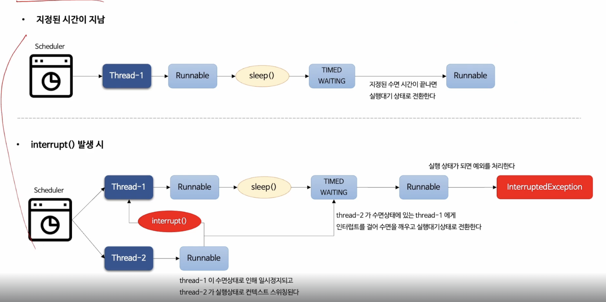
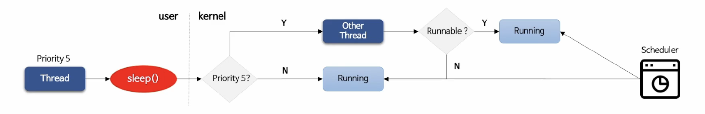
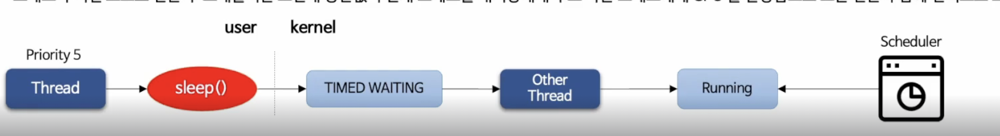
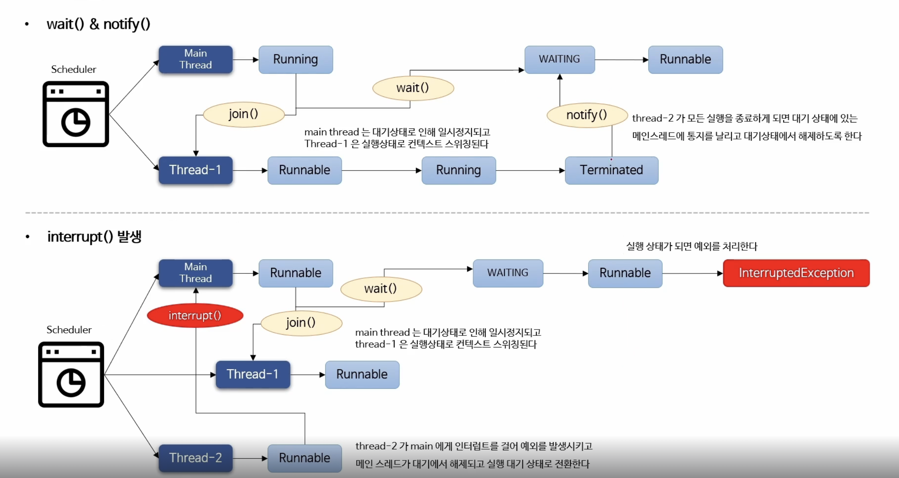

# sleep

지정된 시간동안 현재 스레드의 실행을 일시 정지하고 대기상태로 만들었다가 시간이 지나면 실행대기 상태로 전환된다.

네이티브 메서드와 연결되며 시스템 호출을 통해 커널모드에서 수행 후 유저모드로 전환한다.

이 메서드는 커널 스레드를 사용하므로 컨텍스트 스위칭 발생을 하는 메서드이며, 자원 사용비용은 사용자 스레드를 사용하는 것 보다는 당연히 비싸다.

## API 

### Thread#sleep(long millis)

```java
public class Thread implements Runnable {
	//...
	public static native sleep(long millis) throws InterruptedException
	//...
}
```

- 지정한 밀리초 시간동안 스레드를 수면상태로 만든다.
- 밀리초는 양수이며 음수일 경우 `IllegalArgumentException` 을 발생한다.

### Thread#sleep(long millis, nanos)

```java
public class Thread implements Runnable {
	//...
	public static void sleep(long millis, int nanos)  
throws InterruptedException {  
	    if (millis < 0) {  
	        throw new IllegalArgumentException("timeout value is negative");  
	    }  
	  
	    if (nanos < 0 || nanos > 999999) {  
	        throw new IllegalArgumentException(  
	                            "nanosecond timeout value out of range");  
	    }  
	  
	    if (nanos >= 500000 || (nanos != 0 && millis == 0)) {  
	        millis++;  
	    }  
	  
	    sleep(millis);  
	}
	//...
}
```

- 지정한 밀리초에 나노초를 더한 시간동안 스레드를 수면상태로 만든다.
- 나노초의 범위 : `0 <= nanos <= 999999`

## 예외 

### InterruptedException

스레드가 수면 중에 인터럽트 될 경우 `InterruptedException` 예외를 발생시킨다. 다른 스레드는 잠자고 있는 스레드에게 인터럽트(중단, 멈춤) 신호를 보낼수 있다. 

`InterruptedException` 이 발생하면 스레드는 수면상태에서 깨어나고 실행대기 상태로 전환되어 실행상태를 기다린다.

## Code

```java
try {
	Thread.sleep(3000); // 3초 대기 
	Thread.sleep(3000, 9000) // 3초 + 9000 나노초(9 마이크로 초) 대기 : 3.000009 초 대기
} catch (InterruptedException e) {
	// TODO Interrupted 예외 처리
}
```

### sleep 의 작동방식


### sleep(0) & sleep(1)

 sleep 메서드는 네이티브 메서드이기 때문에 메서드를 실행하게 되면 시스템 호출을 하여 커널 스레드를 사용하게 된다. 이때 다른 스레드에게 명확하게 실행을 양보하기 위함이라면 sleep(0) 보다는 sleep(1) 을 사용한다.

#### sleep(0)

스레드가 커널모드 전환 후 스케줄러는 현재 스레드와 동일한 우선순위(`priority`)의 스레드가 있을 경우 실행대기 상태 스레드에게 CPU 를 할당함으로 컨텍스트 스위칭이 발생한다. 

만약 우선순위가 동일한 실행대기 상태의 다른 스레드가 없으면 스케줄러는 현재 스레드에게 계속 CPU 를 할당해서 컨텍스트 스위칭이 없고 모드 전환만 일어난다.



#### sleep(n)

일반적으로 사용하는 방법으로 스레드가 커널모드로 전환 후 스케줄러는 조건에 상관없이 스레드를 `TIME_WAITING` 상태로 전환하고 다른 스레드에게 CPU 를 할당함으로써 모드 전환(사용자 - > 커널)과 함께 컨텍스트 스위칭이 발생한다.


# join

한 스레드가 다른스레드가 종료될때까지 실행을 중지하고 대기상태에 들어갔다가 스레드가 종료되면 실행대기 상태로 전환한다. 

스레드의 순서를 제어하거나 다른 스레드의 작업을 기다려야할 때 순차적은 흐름을 구성하고자 할 때 사용한다.
`Object#wait` 네이티브 메서드로 연결되며 시스템 호출을 통해 커널 모드로 수행한다. 

- 내부적으로 `wait()` & `notify()` 흐름을 가지고 제어한다.

## API

### Thread#join()

```java
public class Thread implements Runnable {
	//...
	public final void join() throws InterruptedException {  
	    join(0);  
	}
	//...
}
```

- 스레드의 작업이 종료 될 때까지 대기상태를 유지

### Thread#join(long millis)

```java
public class Thread implements Runnable {
	// ...
	public final synchronized void join(long millis)  
	throws InterruptedException {  
	    long base = System.currentTimeMillis();  
	    long now = 0;  
	  
	    if (millis < 0) {  
	        throw new IllegalArgumentException("timeout value is negative");  
	    }  
	  
	    if (millis == 0) {  
	        while (isAlive()) {  
	            wait(0);  
	        }  
	    } else {  
	        while (isAlive()) {  
	            long delay = millis - now;  
	            if (delay <= 0) {  
	                break;  
	            }  
	            wait(delay);  
	            now = System.currentTimeMillis() - base;  
	        }  
	    }
	}
	// ...
}
```

`void join(log millis) throws InterruptedException`

- 지정한 밀리초 동안 스레드 대기 상태를 유지한다.
- 밀리초는 양수이며 음수일 경우 `IllegalArgumentException` 발생

### Thread#join(long millis, int nanos)

```java
public class Thread implements Runnable {
	// ...
	public final synchronized void join(long millis, int nanos)  
throws InterruptedException {  
  
	    if (millis < 0) {  
	        throw new IllegalArgumentException("timeout value is negative");  
	    }  
	  
	    if (nanos < 0 || nanos > 999999) {  
	        throw new IllegalArgumentException(  
	                            "nanosecond timeout value out of range");  
	    }  
	  
	    if (nanos >= 500000 || (nanos != 0 && millis == 0)) {  
	        millis++;  
	    }  
	  
	    join(millis);  
	}
	// ...
}
```

- 지정한 밀리초에 나노초를 더암만큼 대기
- 나노초는 `0 <= nanos <= 999999` 범위를 갖는다.

## 예외

### InterrptedException

- 소레드가 인터럽트 될 경우 `InterruptedException` 예외를 발생한다.
- 다른 스레드는 `join()` 을 수행 중인 스레드에게 인터럽트(중단, 멈춤) 신호를 보낼 수 이다.
- `InterruptedException` 예외 발생시 스레드는 대기상태에서 실행상태로 전환되어 실행상태를 기다린다.

## Code

```java
try {
	thread.join();
} catch (InterruptedException e) {
	// 인터럽트 예외 처리
}
```

## Join 을 이용한 순서제어



join 을 호출한 스레드를 대기상태로 전환하고 호출 대상 스레드에게 CPU 를 사용하도록 한다.
이때 join 을 호출한 스레드가 인터럽트 되면 해당 스레드는 대기에서 해제되고 실행상태로 전환되어 예외를 처리한다.

### 기본적인 join()
```java
public class ThreadJoin {  
    public static void main(String[] args) {  
        System.out.println("=> 메인 스레드 시작");  
  
        // 메인스레드에서 생성되는 자식 스레드  
        Thread thread1 = new Thread(() -> {  
            try {  
                System.out.println("=> 자식 스레드 3초 대기 시작");  
                Thread.sleep(3000);  
                System.out.println("스레드 3초 대기 종료");  
            } catch (InterruptedException e) {  
                System.out.println("첫 번째 스레드 인터럽트로 인한 예외처리");  
            }  
        });  
  
        thread1.start();  
        try {  
            System.out.println("메인 스레드에서 자식 스레드가 종료될 때까지 대기");  
            thread1.join();  
            System.out.println("자식 스레드 종료에 따른 메인 스레드 작업 진행");  
        } catch (InterruptedException e) {  
            System.out.println("메인 스레드 인터럽트로 인한 예외처리");  
        }  
  
        System.out.println("=> 메인 스레드 종료");  
    }
}
```

위 코드는 아래와 같은 결과를 기대할 수 있다. 

```
=> 메인 스레드 시작
메인 스레드에서 자식 스레드가 종료될 때까지 대기
=> 자식 스레드 3초 대기 시작
스레드 3초 대기 종료
자식 스레드 종료에 따른 메인 스레드 작업 진행
=> 메인 스레드 종료
```

### MultiThreadJoin

다음은 여러 스레드에 대한 join 처리이다.

```java
public class MultiThreadJoin {  
    public static void main(String[] args) {  
        System.out.println("=> 메인 스레드 시작");  
        Thread thread1 = new Thread(() -> {  
            System.out.println("=> 첫 번째 스레드 진행");  
            try {  
                Thread.sleep(3000);  
            } catch (InterruptedException e) {  
                System.out.println("첫 번째 스레드 인터럽트로 인한 예외처리");  
            }  
            System.out.println("=> 첫 번째 스레드 완료");  
        });  
  
        Thread thread2 = new Thread(() -> {  
            System.out.println("=> 두 번째 스레드 진행");  
            try {  
                Thread.sleep(2000);  
            } catch (InterruptedException e) {  
                System.out.println("두 번째 스레드 인터럽트로 인한 예외처리");  
            }  
            System.out.println("=> 두 번째 스레드 완료");  
        });  
        thread1.start();  
        thread2.start();  
  
        try {  
            thread1.join();  
            thread2.join();  
        } catch (InterruptedException e) {  
            System.out.println("메인 스레드 인터럽트로 인한 예외처리");  
        }  
  
        System.out.println("=> 메인 스레드 종료");  
    }  
}
```

### InterruptedJoin 

```java
public class ThreadInterruptJoin {  
    public static void main(String[] args) {  
        Thread mainThread = Thread.currentThread();  
        Thread longRunningThread = new Thread(() -> {  
            try {  
                System.out.println("=> 자식 스레드 20초 대기 시작");  
                for (int i = 0; i < 20; i++) {  
                    System.out.println("=> 작업 진행 : " + i);  
                    Thread.sleep(1000);  
                }  
                System.out.println("=> 자식 스레드 20초 대기 종료");  
            } catch (InterruptedException e) {  
                // 이 부분은 interruptThread 에서 interrupt() 호출시에만 실행된다.  
                mainThread.interrupt();  
                System.out.println("자식 스레드 인터럽트로 인한 예외처리");  
            }  
        });  
  
        longRunningThread.start();  
  
        Thread interruptingThread = new Thread(() -> {  
            try {  
                System.out.println("인터럽트 스레드가 2초 후 긴 작업 스레드 인터럽트");  
                Thread.sleep(2000);  
                longRunningThread.interrupt();  
            } catch (InterruptedException e) {  
                throw new RuntimeException(e);  
            }  
        });  
  
        interruptingThread.start();  
  
        try {  
            System.out.println("메인 스레드가 긴 작업 스레드 완료 대기");  
            longRunningThread.join();  
            System.out.println("긴작업 완료 ");  
        } catch (InterruptedException e) {  
            System.out.println("메인 스레드 인터럽트로 인한 예외처리");  
        }  
    }  
}
```


# interrupt / interrupted / isInterrupted

자바에서 interrupt() 는 특정 스레드에 신호를 줌으로서 스레드의 실행을 중단하거나 작업 취소, 강제 종료 등으로 사용할 수 있다.

## API
### Thread#interrupt

```java
public class Thread implements Runnable {
	public void interrupt() {  
	    if (this != Thread.currentThread()) {  
	        checkAccess();  
	  
	        // thread may be blocked in an I/O operation  
	        synchronized (blockerLock) {  
	            Interruptible b = blocker;  
	            if (b != null) {  
	                interrupt0();  // set interrupt status  
	                b.interrupt(this);  
	                return;            }  
	        }  
	    }  
	  
	    // set interrupt status  
	    interrupt0();  
	}
	private native void interrupt0();
}
```

이 메서드는 스레드에게 인터럽트가 발생했다는 신호를 보내어 스레드가 현재 실행 흐름을 멈추고 인터럽트 이벤트를 먼저 처리하도록 시그널을 보넨다.

#### interrupted

스레드는 인터럽트 상태로 알려진 `interrupted`를 가지고 있으며 인터럽트 발생 여부를 확인할 수 있는 상태값으로 기본값은 `false`이다. 

인터럽트된 스레드가 처리해야하는 특별한 규칙이나 정해진 기준은 없으나 일반적으로 인터럽트 상태를 사용해서 스레드를 중지하거나, 작업 취소, 강제 종료 등의 기능을 구현할 수 있다. 

한 스레드는 다른 스레드를 인터럽트 할 수 있고 자기 자신을 인터럽트 할 수도 있으며 인터럽트하는데 횟수제한이 없고, 인터럽트 할 때마다 스레드의 인터럽트 상태를 true 로 변경한다.

### Thread#interrupted

```java
public class Thread implements Runnable {
	public static boolean interrupted() {  
	    return currentThread().isInterrupted(true);  
	}
	@HotSpotIntrinsicCandidate  
	private native boolean isInterrupted(boolean ClearInterrupted);
}
```

스레드의 인터럽트 상태를 반환하는 정적 메소드로 현재 인터럽트 상태가 `true` 인 경우 `true`를 반환하고 인터럽트 상태를 `false`로 초기화 하므로 *`인터럽트를 해제하는 역할`* 을 한다.

인터럽트를 해제하는 경우 다른 곳에서 스레드에 대한 인터럽트 상태를 체크하는 곳이 있다면 별도의 처리가 필요할 수 있다. 

인터럽트를 강제로 해제했기 때문에 다시 인터럽트를 걸어 상태를 유지할 수 있다.

아래는 `interrupt`와 `interrupted`, `isInterrupted` 에 대한 관계를 그림으로 정리한 것이다 (정수원 선생님 강의에서 퍼옴)

![[interrupt.png]]

### Thread#isInterrupted

```java
public class Thread implements Runnable {
	public boolean isInterrupted() {  
	    return isInterrupted(false);  
	}
	@HotSpotIntrinsicCandidate  
	private native boolean isInterrupted(boolean ClearInterrupted);
}
```

스레드의 인터럽트 상태를 반환하는 인스턴스 메서드로 스레드의 인터럽트 상태를 변경하지 않고 계속 유지한다.

인터럽트의 *`상태를 확인하는`* 용도로만 사용할 경우 `Thread#interrupted` 보다 이 메서드를 사용하는것이 좋다.

## 예외

### InterruptedException

interrupt 의 일부로 대기나 차단 등 블록킹 상태가 있거나 블록킹 상태를 만나는 시점의 스레드에 인터럽트를 할 때 발생하는 예외로 `InterruptedException` 이 발생하면 인터럽트 상태는 자동으로 초기화(true -> false) 된다. 즉 `Thread.interrupted()` 한 것과 동일한 상태로 변경된다

다른 곳에서 인터럽트 상태를 참조하고 있다면 예외 구분에서 대상 스래드를 다시 interrupt() 해야할 수도 있다.

- sleep()
- join()
- wait()
- Future.get()
- BlockingQueue.take()

위 같은 케이스에서 발생할 수 있다. 

![[interrupted_exception.png]]

# name / currentThread / isAlive

## Thread Name

멀티 스레드 환경에서 어떤 스레드가 실행중인지 확인이 필요한 경우 스레드에서 사용자 이름을 지정하여 손쉽게 실행중인 스레드를 찾을 수 있다. 

- 디버깅 시 어던 스레드가 어떠한 작업을 하고 있는지 정확하게 파악하기 위해서는 스레드 이름을 지정하는 것이 도움된다.

자바에서 스레드가 생성되면 스레드 이름이 자동으로 주어지며, 사용자가 지정하는 것은 아니다. 

- main, Thread-0, Thread-1 
- main 은 자바가 실행됨가 동시에 생성되고 Thread-0부터 순차적으로 증가하면서 이름을 만듬

자바에서 사용자가 직접 스레드 이름을 지정할 수 있다.

```java
Thread t1 = new Thread ([ThreadGroup], [Runnable], "thread name"); 
t1.setName("thread name"); 
t1.getName(); // 이름 조회
```

#### 나만 알까?

```java
public class ThreadName {
	public static void main(Stringp[] args) {
		Thread setThreadName = new Thread(() -> {  
		    System.out.println("Thread name: " + Thread.currentThread().getName());  
		});  
		setThreadName.setName("setThreadName");  
		setThreadName.start();  
		Thread t = new Thread(() -> {  
		    System.out.println("Thread name: " + Thread.currentThread().getName());  
		});  
		t.start();
	}
}
```

강사님 강의에서 위 코드와 같이 setName 메서드를 호출하면 기본 생성되는 이름이 1번 인덱스부터 시작한다고 하셧다 그 원인을 분석해 본 결과 아래와 같은 원인이 있었다.

```java
public class Thread {
	public Thread() {  
	    this(null, null, "Thread-" + nextThreadNum(), 0);  
	}
	
	public Thread(Runnable target) {  
	    this(null, target, "Thread-" + nextThreadNum(), 0);  
	}
	
	Thread(Runnable target, @SuppressWarnings("removal") AccessControlContext acc) {  
	    this(null, target, "Thread-" + nextThreadNum(), 0, acc, false);  
	}	


	public Thread(ThreadGroup group, Runnable target) {  
	    this(group, target, "Thread-" + nextThreadNum(), 0);  
	}  
  
	public Thread(String name) {  
	    this(null, null, name, 0);
	}

	public Thread(ThreadGroup group, String name) {  
	    this(group, null, name, 0);  
	}
	
	public Thread(Runnable target, String name) {  
	    this(null, target, name, 0);  
	}

	public Thread(ThreadGroup group, Runnable target, String name) {  
	    this(group, target, name, 0);  
	}

	public Thread(ThreadGroup group, Runnable target, String name,  
              long stackSize) {  
	    this(group, target, name, stackSize, null, true);  
	}

	public Thread(ThreadGroup group, Runnable target, String name,  
              long stackSize, boolean inheritThreadLocals) {  
	    this(group, target, name, stackSize, null, inheritThreadLocals);  
	}

	private Thread(ThreadGroup g, Runnable target, String name,  
               long stackSize, AccessControlContext acc,  
               boolean inheritThreadLocals) {  
	    if (name == null) {  
	        throw new NullPointerException("name cannot be null");  
	    }  
	  
	    this.name = name;
	    
	    // ...
    }
	private static synchronized int nextThreadNum() {  
	    return threadInitNumber++;  
	}

}

```

`setName` 메서드를 호출하기전 `new Thread` 를 이요해서 초기화 해주게 되는데 위에 코드를 보면 nextThreadNum() 이 호출되는것을 확인할 수 있다. 

실제 초기화를 위한 생성자에서는 name이 없으면 npe 가 발생하기 때문에 기본 생성자들 에서는 nextThreadNum을 무조건 호출하게 되어있었다.

초기에 Thread 의 이름을 셋팅하는 경우에는 해당 메서드가 호출되지 않는것을 확인 할 수 있다.

## Thread#currentThread

현제 실행중인 스레드를 반환하는 정적 메서드이다.

```java
public class Thread {
	// jdk 11
	@HotSpotIntrinsicCandidate  
	public static native Thread currentThread();

	// jdk 17
	@IntrinsicCandidate  
	public static native Thread currentThread();
}
```

## Thread#isAlive

스레드가 살아있는지 여부를 판단하는 메서드로 start() 메서드가 호출되고 스레드가 아직 종료되지 않은 경우 활성화 된 것으로 판단하여 true 반환

```java
public class Thread {

	public final native boolean isAlive();
}
```


# Priority

